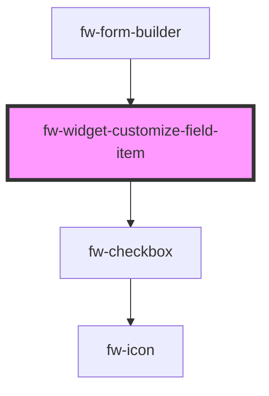

# Form Builder (fw-form-builder)

fw-form-builder can be used to create/edit/delete fields in an entity. It can also be used to set customized fields, search, re-order fields.

## Demo

```html live
<div
  style="
        width: 100%;
        height: 100%;
        box-sizing: border-box;
        background: #ffffff;
        border: 1px solid rgba(207, 215, 223, 0.4);
        box-shadow: 0px 4px 4px rgba(209, 209, 209, 0.4);
        border-radius: 2px;
        overflow: hidden;
      "
>
  <fw-form-builder id="formBuilder"></fw-form-builder>
</div>

<script type="application/javascript">
  var customizeWidgetFields = [];

  var formValues = {
    name: 'Company-Association-test',
    prefix: '_29',
    title: null,
    description: 'Company-Association-test',
    version: 4,
    devared: false,
    id: 5938,
    form_options: {},
    created_time: 1659001461188,
    updated_time: 1659004708385,
    icon_link: 'https://d2lz1e868xzctj.cloudfront.net/icons/Accounts.svg',
    fields: [
      {
        id: '24a9531c-3c71-463e-9c63-8991396fde95',
        name: 'companyassociationtestname',
        label: 'Hotel Name',
        type: 'PRIMARY',
        position: 1,
        required: true,
        editable: true,
        visible: true,
        devared: false,
        placeholder: null,
        hint: null,
        field_options: {
          _analytic: 'true',
          _primary: 'true',
          unique: 'true',
        },
        filterable: true,
        searchable: true,
        parent_id: null,
        choices: [],
      },
      {
        id: 'eea9ed82-af63-43b2-aef0-a7e8de0f8607',
        name: 'companytest',
        label: 'Location',
        type: 'RELATIONSHIP',
        position: 2,
        required: false,
        editable: true,
        visible: true,
        devared: false,
        placeholder: null,
        hint: null,
        field_options: {
          _analytic: 'true',
          related_object_type: 'NATIVE',
          unique: 'false',
        },
        filterable: true,
        searchable: false,
        parent_id: null,
        related_entity_id: 3,
        relationship_name: 'companytest',
        child_relationship_name: 'companyassociationtest_1659004707038',
        choices: [],
      },
      {
        id: '3f2235be-b18a-443f-9944-c9ae10195e97',
        name: 'contactname',
        label: 'Booking',
        type: 'RELATIONSHIP',
        position: 3,
        required: false,
        editable: true,
        visible: true,
        devared: false,
        placeholder: null,
        hint: null,
        field_options: {
          _analytic: 'true',
          related_object_type: 'NATIVE',
          unique: 'false',
        },
        filterable: true,
        searchable: false,
        parent_id: null,
        related_entity_id: 2,
        relationship_name: 'contactname',
        child_relationship_name: 'companyassociationtest_1659001527018',
        choices: [],
      },
    ],
  };

  var lookupTargets = [
    {
      value: 1,
      text: 'Ticket',
      isNative: true,
    },
    {
      value: 2,
      text: 'Contact',
      isNative: true,
    },
    {
      value: 4853,
      text: 'Booking ID',
      isNative: false,
    },
    {
      value: 5021,
      text: 'Native-ticket',
      isNative: false,
    },
  ];

  var fb = document.getElementById('formBuilder');
  fb.formValues = formValues;
  fb.lookupTargetObjects = lookupTargets;

  function create_UUID() {
    var dt = new Date().getTime();
    var uuid = 'xxxxxxxx-xxxx-4xxx-yxxx-xxxxxxxxxxxx'.replace(
      /[xy]/g,
      function (c) {
        var r = (dt + Math.random() * 16) % 16 | 0;
        dt = Math.floor(dt / 16);
        return (c == 'x' ? r : (r & 0x3) | 0x8).toString(16);
      }
    );
    return uuid;
  }

  fb.addEventListener('fwComposeNewField', (event) => {
    var objFormValuess = event.detail;
    var intAddedIndex = -1;
    var arrFields = formValues.fields;
    var intIndex = objFormValuess.index;
    var objDefaultField = objFormValuess.fieldSchema;
    objDefaultField.isNew = true;
    objDefaultField.id = 'new-field';

    if (arrFields.length === 0 || intIndex < 0 || intIndex > arrFields.length) {
      arrFields = [...arrFields, objDefaultField];
      intAddedIndex = arrFields.length - 1;
    } else {
      arrFields = [
        ...arrFields.slice(0, intIndex),
        objDefaultField,
        ...arrFields.slice(intIndex),
      ];
      intAddedIndex = intIndex;
    }

    if (intAddedIndex !== -1) {
      formValues = { ...formValues, fields: arrFields };
      fb.formValues = formValues;
      fb.expandedFieldIndex = intAddedIndex;
    }
  });

  deleteNewLocalFieldAtIndex = (intIndex) => {
    var arrFields = m.fields;
    if (
      arrFields &&
      arrFields.length > 0 &&
      intIndex < arrFields.length &&
      arrFields[intIndex]?.isNew === true
    ) {
      arrFields = [
        ...arrFields.slice(0, intIndex),
        ...arrFields.slice(intIndex + 1),
      ];
      formValues = { ...formValues, fields: arrFields };
      fb.formValues = formValues;
    }
  };

  fb.addEventListener('fwExpandField', (event) => {
    var objFormValues = event.detail;
    var intIndex = objFormValues.index;
    var boolExpanded = objFormValues.expanded;
    fb.expandedFieldIndex = boolExpanded ? intIndex : -1;
    if (!boolExpanded && objFormValues.isNew && intIndex > -1) {
      deleteNewLocalFieldAtIndex(intIndex);
    }
  });

  fb.addEventListener('fwDeleteField', (event) => {
    fb.loading = true;
    var arrFields = formValues.fields;
    arrFields.splice(event.detail.index, 1);
    formValues = { ...formValues, fields: arrFields };
    fb.formValues = formValues;
    fb.loading = false;
  });

  // delete local field which was added if there are no fields present
  deleteNewFieldFromPayload = (arrFields) => {
    try {
      const intNewFieldIndex = arrFields.findIndex(
        (e) => e.id === 'new-field' && e.isNew === true
      );
      if (intNewFieldIndex > -1) {
        arrFields.splice(intNewFieldIndex, 1);
      }
    } catch (error) {}
  };

  fb.addEventListener('fwSaveField', (event) => {
    fb.loading = true;
    var arrFields = formValues.fields;
    var objDetail = event.detail;
    var objFormValues = objDetail.value;
    var boolNewField = objDetail.isNew;
    var intIndex = Object.prototype.hasOwnProperty.call(objDetail, 'index')
      ? objDetail.index
      : -1;
    var intAddedIndex = intIndex;
    var isPrimaryField = !!(
      Object.prototype.hasOwnProperty.call(objFormValues, 'isPrimaryField') &&
      objFormValues.isPrimaryField === true
    );
    var strFieldLabel = objFormValues.name;
    var strFieldType = !isPrimaryField ? objFormValues.type : 'PRIMARY';
    var boolFilterable = Object.prototype.hasOwnProperty.call(
      objFormValues,
      'filterable'
    )
      ? objFormValues.filterable
      : false;
    var boolUnique = Object.prototype.hasOwnProperty.call(
      objFormValues,
      'unique'
    )
      ? objFormValues.unique
      : false;
    var arrChoices =
      Object.prototype.hasOwnProperty.call(objFormValues, 'choices') &&
      objFormValues.choices &&
      objFormValues.choices.length > 0
        ? [...objFormValues.choices]
        : [];

    var strRemovedSpecialChars = strFieldLabel.replace(/[^a-zA-Z0-9 ]/g, '');
    var strGeneratedFieldName = strRemovedSpecialChars
      .split(' ')
      .join('_')
      .toLowerCase();

    // make the api call to save the new/edited field data in the DB
    // Temp - updating local field
    var objUpdatedField = null;
    deleteNewFieldFromPayload(arrFields);

    if (boolNewField) {
      objUpdatedField = {
        id: '',
        name: '',
        label: '',
        type: '',
        required: false,
        filterable: false,
        editable: true,
        visible: false,
        deleted: false,
        link: null,
        placeholder: null,
        hint: null,
        field_options: { unique: false },
        searchable: true,
        parent_id: null,
        choices: [],
      };
      if (strFieldType === 'DECIMAL') {
        objUpdatedField.searchable = false;
      }
      // Name and ID Needs to be generated at the backend
      objUpdatedField.name = strGeneratedFieldName;
      objUpdatedField.id = create_UUID();
    } else {
      if (arrFields && intAddedIndex >= 0 && intAddedIndex < arrFields.length) {
        objUpdatedField = arrFields[intAddedIndex];
      } else {
        console.error('Field not found in entity object..');
        return null;
      }
    }

    var boolUpdateUniqueValue = true;
    if (strFieldType === 'RELATIONSHIP') {
      // update lookup relationship data if its a new Field
      if (boolNewField) {
        var objRelationshipValues = objFormValues.relationship;
        var objRelatedEntity = {
          isNative: false,
          text: objRelationshipValues.target, // display name of the related entity
          value: 1, // id of the related entity
        };
        objUpdatedField.related_entity_id = objRelatedEntity.id;
        objUpdatedField.relationship_name = strGeneratedFieldName; // needs to be unique within the entity
        objUpdatedField.child_relationship_name = `${strGeneratedFieldName}_${new Date().getTime()}`; // needs to be unique within the entity
        objUpdatedField.field_options.unique =
          objRelationshipValues.relationship === 'one_to_one';
      }
      boolUpdateUniqueValue = false;
    }

    objUpdatedField.type = strFieldType;
    objUpdatedField.label = strFieldLabel;
    objUpdatedField.required = objFormValues.required;
    objUpdatedField.filterable = boolFilterable;
    objUpdatedField.choices = arrChoices;
    if (boolUpdateUniqueValue) {
      objUpdatedField.field_options.unique = boolUnique;
    }

    if (boolNewField) {
      // validate if the array is empty or the passed index is invalid - if true -push the element at the end of the array
      if (
        arrFields.length === 0 ||
        intIndex < 0 ||
        intIndex > arrFields.length
      ) {
        arrFields = [...arrFields, objUpdatedField];
        intAddedIndex = arrFields.length - 1;
      } else {
        // store the element at the passed index
        arrFields = [
          ...arrFields.slice(0, intIndex),
          objUpdatedField,
          ...arrFields.slice(intIndex),
        ];
        intAddedIndex = intIndex;
      }
    }

    fb.expandedFieldIndex = -1;
    formValues = { ...formValues, fields: arrFields };
    fb.formValues = formValues;
    fb.loading = false;
  });

  fb.addEventListener('fwRepositionField', (event) => {
    var objFormValues = event.detail;
    var intSourceIndex = objFormValues.sourceIndex;
    var intTargetIndex = objFormValues.targetIndex;
    if (intSourceIndex === intTargetIndex) {
      return;
    }

    try {
      var arrFields = formValues.fields;
      var objField = arrFields.splice(intSourceIndex, 1)[0];
      arrFields.splice(intTargetIndex, 0, objField);
      formValues = { ...formValues, fields: arrFields };
      fb.formValues = formValues;
    } catch (error) {
      console.error('Error in repositioning field ' + error);
    }
  });

  fb.addEventListener('fwSaveWidgetFields', (event) => {
    customizeWidgetFields = event.detail;
    fb.customizeWidgetFields = customizeWidgetFields;
    fb.isSavingCustomizeWidget = false;
  });
</script>
```

## Usage

<code-group>
<code-block title="HTML">
```html 
      <div
      style="
        width: 100%;
        height: 100%;
        box-sizing: border-box;
        background: #ffffff;
        border: 1px solid rgba(207, 215, 223, 0.4);
        box-shadow: 0px 4px 4px rgba(209, 209, 209, 0.4);
        border-radius: 2px;
        overflow: hidden;
      "
    >
      <fw-form-builder id="formBuilder"></fw-form-builder>
    </div>

    <script type="application/javascript">
      var customizeWidgetFields = [];

      var formValues = {
        name: 'Company-Association-test',
        prefix: '_29',
        title: null,
        description: 'Company-Association-test',
        version: 4,
        devared: false,
        id: 5938,
        form_options: {},
        created_time: 1659001461188,
        updated_time: 1659004708385,
        icon_link: 'https://d2lz1e868xzctj.cloudfront.net/icons/Accounts.svg',
        fields: [
          {
            id: '24a9531c-3c71-463e-9c63-8991396fde95',
            name: 'companyassociationtestname',
            label: 'Hotel Name',
            type: 'PRIMARY',
            position: 1,
            required: true,
            editable: true,
            visible: true,
            devared: false,
            placeholder: null,
            hint: null,
            field_options: {
              _analytic: 'true',
              _primary: 'true',
              unique: 'true',
            },
            filterable: true,
            searchable: true,
            parent_id: null,
            choices: [],
          },
          {
            id: 'eea9ed82-af63-43b2-aef0-a7e8de0f8607',
            name: 'companytest',
            label: 'Location',
            type: 'RELATIONSHIP',
            position: 2,
            required: false,
            editable: true,
            visible: true,
            devared: false,
            placeholder: null,
            hint: null,
            field_options: {
              _analytic: 'true',
              related_object_type: 'NATIVE',
              unique: 'false',
            },
            filterable: true,
            searchable: false,
            parent_id: null,
            related_entity_id: 3,
            relationship_name: 'companytest',
            child_relationship_name: 'companyassociationtest_1659004707038',
            choices: [],
          },
          {
            id: '3f2235be-b18a-443f-9944-c9ae10195e97',
            name: 'contactname',
            label: 'Booking',
            type: 'RELATIONSHIP',
            position: 3,
            required: false,
            editable: true,
            visible: true,
            devared: false,
            placeholder: null,
            hint: null,
            field_options: {
              _analytic: 'true',
              related_object_type: 'NATIVE',
              unique: 'false',
            },
            filterable: true,
            searchable: false,
            parent_id: null,
            related_entity_id: 2,
            relationship_name: 'contactname',
            child_relationship_name: 'companyassociationtest_1659001527018',
            choices: [],
          },
        ],
      };

      var lookupTargets = [
        {
          value: 1,
          text: 'Ticket',
          isNative: true,
        },
        {
          value: 2,
          text: 'Contact',
          isNative: true,
        },
        {
          value: 4853,
          text: 'Booking ID',
          isNative: false,
        },
        {
          value: 5021,
          text: 'Native-ticket',
          isNative: false,
        },
      ];

      var fb = document.getElementById('formBuilder');
      fb.formValues = formValues;
      fb.lookupTargetObjects = lookupTargets;

      function create_UUID() {
        var dt = new Date().getTime();
        var uuid = 'xxxxxxxx-xxxx-4xxx-yxxx-xxxxxxxxxxxx'.replace(
          /[xy]/g,
          function (c) {
            var r = (dt + Math.random() * 16) % 16 | 0;
            dt = Math.floor(dt / 16);
            return (c == 'x' ? r : (r & 0x3) | 0x8).toString(16);
          }
        );
        return uuid;
      }

      fb.addEventListener('fwComposeNewField', (event) => {
        var objFormValuess = event.detail;
        var intAddedIndex = -1;
        var arrFields = formValues.fields;
        var intIndex = objFormValuess.index;
        var objDefaultField = objFormValuess.fieldSchema;
        objDefaultField.isNew = true;
        objDefaultField.id = 'new-field';

        if (
          arrFields.length === 0 ||
          intIndex < 0 ||
          intIndex > arrFields.length
        ) {
          arrFields = [...arrFields, objDefaultField];
          intAddedIndex = arrFields.length - 1;
        } else {
          arrFields = [
            ...arrFields.slice(0, intIndex),
            objDefaultField,
            ...arrFields.slice(intIndex),
          ];
          intAddedIndex = intIndex;
        }

        if (intAddedIndex !== -1) {
          formValues = { ...formValues, fields: arrFields };
          fb.formValues = formValues;
          fb.expandedFieldIndex = intAddedIndex;
        }
      });

      deleteNewLocalFieldAtIndex = (intIndex) => {
        var arrFields = m.fields;
        if (
          arrFields &&
          arrFields.length > 0 &&
          intIndex < arrFields.length &&
          arrFields[intIndex]?.isNew === true
        ) {
          arrFields = [
            ...arrFields.slice(0, intIndex),
            ...arrFields.slice(intIndex + 1),
          ];
          formValues = { ...formValues, fields: arrFields };
          fb.formValues = formValues;
        }
      };

      fb.addEventListener('fwExpandField', (event) => {
        var objFormValues = event.detail;
        var intIndex = objFormValues.index;
        var boolExpanded = objFormValues.expanded;
        fb.expandedFieldIndex = boolExpanded ? intIndex : -1;
        if (!boolExpanded && objFormValues.isNew && intIndex > -1) {
          deleteNewLocalFieldAtIndex(intIndex);
        }
      });

      fb.addEventListener('fwDeleteField', (event) => {
        fb.loading = true;
        var arrFields = formValues.fields;
        arrFields.splice(event.detail.index, 1);
        formValues = { ...formValues, fields: arrFields };
        fb.formValues = formValues;
        fb.loading = false;
      });

      // delete local field which was added if there are no fields present
      deleteNewFieldFromPayload = (arrFields) => {
        try {
          const intNewFieldIndex = arrFields.findIndex(
            (e) => e.id === 'new-field' && e.isNew === true
          );
          if (intNewFieldIndex > -1) {
            arrFields.splice(intNewFieldIndex, 1);
          }
        } catch (error) {}
      };

      fb.addEventListener('fwSaveField', (event) => {
        fb.loading = true;
        var arrFields = formValues.fields;
        var objDetail = event.detail;
        var objFormValues = objDetail.value;
        var boolNewField = objDetail.isNew;
        var intIndex = Object.prototype.hasOwnProperty.call(objDetail, 'index')
          ? objDetail.index
          : -1;
        var intAddedIndex = intIndex;
        var isPrimaryField = !!(
          Object.prototype.hasOwnProperty.call(
            objFormValues,
            'isPrimaryField'
          ) && objFormValues.isPrimaryField === true
        );
        var strFieldLabel = objFormValues.name;
        var strFieldType = !isPrimaryField ? objFormValues.type : 'PRIMARY';
        var boolFilterable = Object.prototype.hasOwnProperty.call(
          objFormValues,
          'filterable'
        )
          ? objFormValues.filterable
          : false;
        var boolUnique = Object.prototype.hasOwnProperty.call(
          objFormValues,
          'unique'
        )
          ? objFormValues.unique
          : false;
        var arrChoices =
          Object.prototype.hasOwnProperty.call(objFormValues, 'choices') &&
          objFormValues.choices &&
          objFormValues.choices.length > 0
            ? [...objFormValues.choices]
            : [];

        var strRemovedSpecialChars = strFieldLabel.replace(
          /[^a-zA-Z0-9 ]/g,
          ''
        );
        var strGeneratedFieldName = strRemovedSpecialChars
          .split(' ')
          .join('_')
          .toLowerCase();

        // make the api call to save the new/edited field data in the DB
        // Temp - updating local field
        var objUpdatedField = null;
        deleteNewFieldFromPayload(arrFields);

        if (boolNewField) {
          objUpdatedField = {
            id: '',
            name: '',
            label: '',
            type: '',
            required: false,
            filterable: false,
            editable: true,
            visible: false,
            deleted: false,
            link: null,
            placeholder: null,
            hint: null,
            field_options: { unique: false },
            searchable: true,
            parent_id: null,
            choices: [],
          };
          if (strFieldType === 'DECIMAL') {
            objUpdatedField.searchable = false;
          }
          // Name and ID Needs to be generated at the backend
          objUpdatedField.name = strGeneratedFieldName;
          objUpdatedField.id = create_UUID();
        } else {
          if (
            arrFields &&
            intAddedIndex >= 0 &&
            intAddedIndex < arrFields.length
          ) {
            objUpdatedField = arrFields[intAddedIndex];
          } else {
            console.error('Field not found in entity object..');
            return null;
          }
        }

        var boolUpdateUniqueValue = true;
        if (strFieldType === 'RELATIONSHIP') {
          // update lookup relationship data if its a new Field
          if (boolNewField) {
            var objRelationshipValues = objFormValues.relationship;
            var objRelatedEntity = {
              isNative: false,
              text: objRelationshipValues.target, // display name of the related entity
              value: 1, // id of the related entity
            };
            objUpdatedField.related_entity_id = objRelatedEntity.id;
            objUpdatedField.relationship_name = strGeneratedFieldName; // needs to be unique within the entity
            objUpdatedField.child_relationship_name = `${strGeneratedFieldName}_${new Date().getTime()}`; // needs to be unique within the entity
            objUpdatedField.field_options.unique =
              objRelationshipValues.relationship === 'one_to_one';
          }
          boolUpdateUniqueValue = false;
        }

        objUpdatedField.type = strFieldType;
        objUpdatedField.label = strFieldLabel;
        objUpdatedField.required = objFormValues.required;
        objUpdatedField.filterable = boolFilterable;
        objUpdatedField.choices = arrChoices;
        if (boolUpdateUniqueValue) {
          objUpdatedField.field_options.unique = boolUnique;
        }

        if (boolNewField) {
          // validate if the array is empty or the passed index is invalid - if true -push the element at the end of the array
          if (
            arrFields.length === 0 ||
            intIndex < 0 ||
            intIndex > arrFields.length
          ) {
            arrFields = [...arrFields, objUpdatedField];
            intAddedIndex = arrFields.length - 1;
          } else {
            // store the element at the passed index
            arrFields = [
              ...arrFields.slice(0, intIndex),
              objUpdatedField,
              ...arrFields.slice(intIndex),
            ];
            intAddedIndex = intIndex;
          }
        }

        fb.expandedFieldIndex = -1;
        formValues = { ...formValues, fields: arrFields };
        fb.formValues = formValues;
        fb.loading = false;
      });

      fb.addEventListener('fwRepositionField', (event) => {
        var objFormValues = event.detail;
        var intSourceIndex = objFormValues.sourceIndex;
        var intTargetIndex = objFormValues.targetIndex;
        if (intSourceIndex === intTargetIndex) {
          return;
        }

        try {
          var arrFields = formValues.fields;
          var objField = arrFields.splice(intSourceIndex, 1)[0];
          arrFields.splice(intTargetIndex, 0, objField);
          formValues = { ...formValues, fields: arrFields };
          fb.formValues = formValues;
        } catch (error) {
          console.error('Error in repositioning field ' + error);
        }
      });

      fb.addEventListener('fwSaveWidgetFields', (event) => {
        customizeWidgetFields = event.detail;
        fb.customizeWidgetFields = customizeWidgetFields;
        fb.isSavingCustomizeWidget = false;
      });
    </script>

````
</code-block>

</code-group>

<!-- Auto Generated Below -->

## Properties

| Property         | Attribute          | Description                                                                                                | Type                      | Default     |
| ---------------- | ------------------ | ---------------------------------------------------------------------------------------------------------- | ------------------------- | ----------- |
| `dataProvider`   | `data-provider`    | data source used to set and edit the field values                                                          | `any`                     | `null`      |
| `disabled`       | `disabled`         | Disables the component on the interface. If the attribute’s value is undefined, the value is set to false. | `boolean`                 | `false`     |
| `index`          | `index`            | index attached inside the parent group component                                                           | `number`                  | `-1`        |
| `isPrimaryField` | `is-primary-field` | defines if the field is primary                                                                            | `boolean`                 | `false`     |
| `label`          | `label`            | Label displayed as header in the card.                                                                     | `string`                  | `''`        |
| `name`           | `name`             | Name of the component, saved as part of the form data.                                                     | `string`                  | `''`        |
| `pinned`         | `pinned`           | Pinned position of the drag item, other drag item cannot be placed above or below it.                      | `"" \| "bottom" \| "top"` | `undefined` |
| `selected`       | `selected`         | selected property of the component                                                                         | `boolean`                 | `false`     |

## Events

| Event     | Description                                   | Type               |
| --------- | --------------------------------------------- | ------------------ |
| `fwCheck` | Triggered when the card in focus is selected. | `CustomEvent<any>` |

## Dependencies

### Used by

- [fw-form-builder](.)

### Depends on

- fw-checkbox

### Graph



---

_Built with [StencilJS](https://stenciljs.com/)_
````
