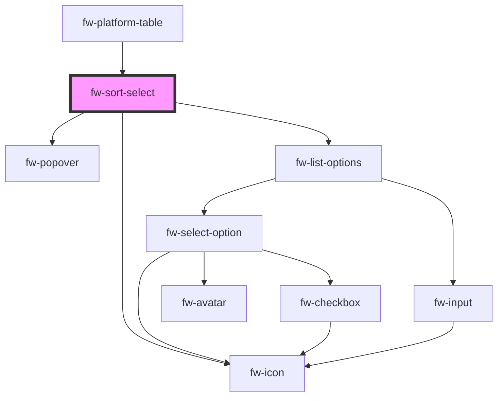

# fw-sort-select

<!-- Auto Generated Below -->

## Properties

| Property      | Attribute  | Description                                                                             | Type    | Default     |
| ------------- | ---------- | --------------------------------------------------------------------------------------- | ------- | ----------- |
| `order`       | `order`    | The sort order.                                                                         | `any`   | `undefined` |
| `orderBy`     | `order-by` | The sort by column key.                                                                 | `any`   | `undefined` |
| `sortOptions` | --         | Select options for the sortable. Array of objects of type {text: string, value: string} | `any[]` | `[]`        |

## Events

| Event    | Description                             | Type               |
| -------- | --------------------------------------- | ------------------ |
| `fwSort` | Triggered on selecting the sort option. | `CustomEvent<any>` |

## Dependencies

### Used by

 - [fw-platform-table](..)

### Depends on

- fw-popover
- fw-icon
- fw-list-options

### Graph

----------------------------------------------

*Built with [StencilJS](https://stenciljs.com/)*
