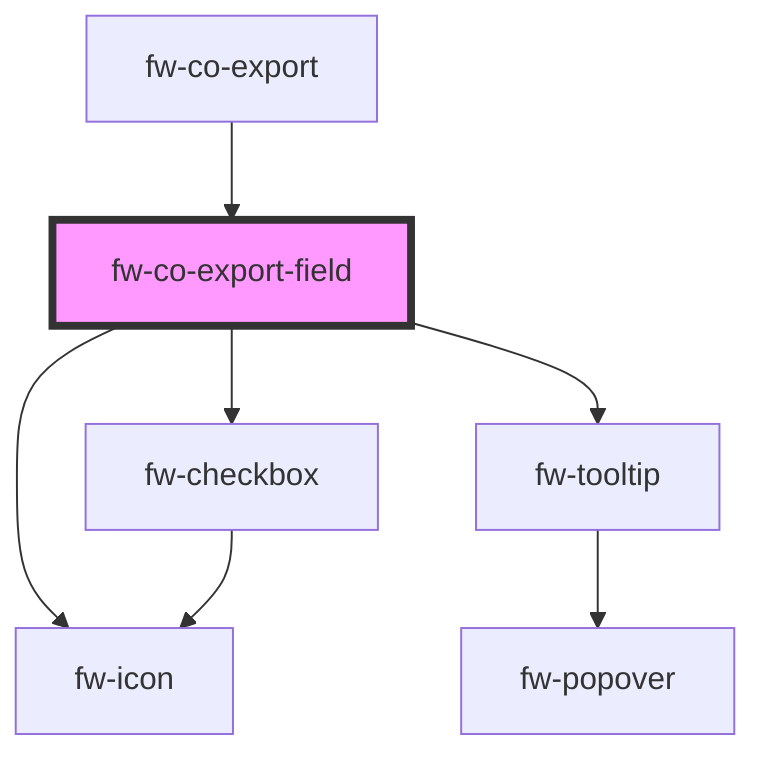

# fw-co-export-field

<!-- Auto Generated Below -->

## Properties

| Property | Attribute | Description                                             | Type  | Default |
| -------- | --------- | ------------------------------------------------------- | ----- | ------- |
| `value`  | `value`   | The value to populate the details of the checkbox field | `any` | `null`  |

## Events

| Event      | Description                                      | Type               |
| ---------- | ------------------------------------------------ | ------------------ |
| `fwChange` | Triggered whenever the export button is selected | `CustomEvent<any>` |

## Dependencies

### Used by

 - [fw-co-export](..)

### Depends on

- fw-checkbox
- fw-tooltip
- fw-icon

### Graph

----------------------------------------------

*Built with [StencilJS](https://stenciljs.com/)*
