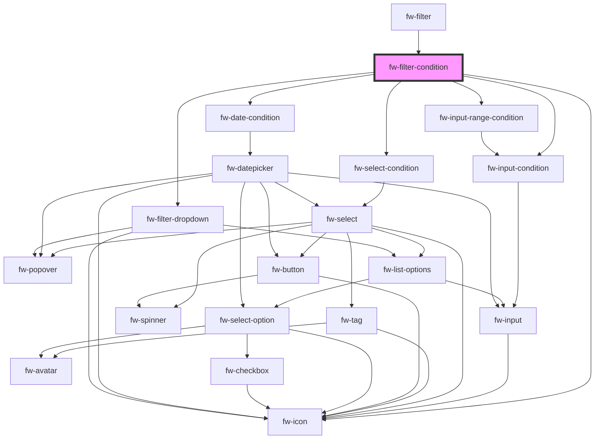

# fw-filter-condition

<!-- Auto Generated Below -->

## Properties

| Property          | Attribute    | Description                                     | Type  | Default     |
| ----------------- | ------------ | ----------------------------------------------- | ----- | ----------- |
| `condition`       | `condition`  | The selected condition                          | `any` | `undefined` |
| `conditionSchema` | --           | The condition schema                            | `{}`  | `{}`        |
| `controlProps`    | --           | The props to be passed to the crayons component | `{}`  | `{}`        |
| `filterOn`        | `filter-on`  | The column key for the filter.                  | `any` | `undefined` |
| `filterText`      | --           | The column display name of the filter           | `{}`  | `{}`        |
| `identifier`      | `identifier` | An unique identifier for the element.           | `any` | `undefined` |
| `value`           | `value`      | The value for the condition                     | `any` | `undefined` |

## Events

| Event      | Description                                     | Type               |
| ---------- | ----------------------------------------------- | ------------------ |
| `fwDelete` | Event Triggered on deleting an filter condition | `CustomEvent<any>` |

## Methods

### `isValid() => Promise<any>`

#### Returns

Type: `Promise<any>`

## Dependencies

### Used by

 - [fw-filter](..)

### Depends on

- [fw-input-condition](../conditions)
- [fw-input-range-condition](../conditions)
- [fw-select-condition](../conditions)
- [fw-date-condition](../conditions)
- [fw-filter-dropdown](../filter-dropdown)
- fw-icon

### Graph

----------------------------------------------

*Built with [StencilJS](https://stenciljs.com/)*
