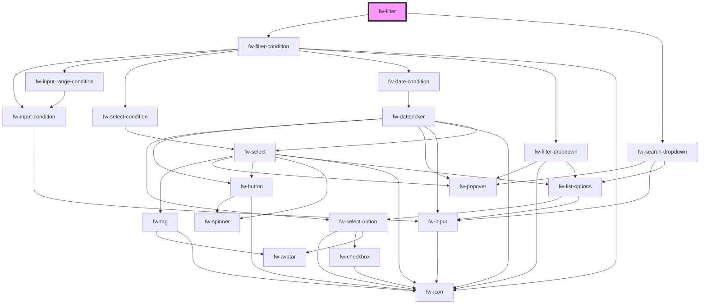

# fw-filter

A Dynamic filter component that will generate a filter form based on the conditionSchema and filters.
### Setting filter data

The filters prop is an Object representing the field on which filter will be performed a sample filters prop is of format `{ <FILTER_KEY> : { text: <FILTER_DISPLAY_TEXT>, type: <FILTER_FIELD_TYPE>}}`. A Sample filters schema is `{ hotel_name: { text: 'Hotel Name', type: 'TEXT' }, hotel_rating: { text: 'Hotel Rating', type: 'NUMBER' }}`. The key is the filter filed key and the name is the display text for the key and the type is the field type which should match with the conditionsSchema.

The conditions schema is an object which provides information to the component on how to define the components for that particular condition. Currently the supported components for the conditions are TEXT, NUMBER, NUMBER_RANGE, DROPDOWN, MULTI_SELECT, DATE, DATE_RANGE. The condition schema is of format `{ <FILTER_FIELD_TYPE> : { <CONDITION_KEY> : { text: <CONDITION_DISPLAY_TEXT>, type: <COMPONENT_TYPE>}}}`, a sample condition schema is shown below
```javascript
{
    number: {
      equals: { text: '=', type: 'NUMBER', default: true },
      gt: { text: '>', type: 'NUMBER' },
      lt: { text: '<', type: 'NUMBER' },
      gte: { text: '>=', type: 'NUMBER' },
      lte: { text: '<=', type: 'NUMBER' },
      between: { text: 'between', type: 'NUMBER_RANGE' },
      is_empty: { text: 'Is empty' },
    },
    text: {
      equals: { text: '=', type: 'TEXT', default: true },
      is_empty: { text: 'Is empty' },
    },
  }
}
```
### Fetching filter data
The `getValue` method will return a promise which will resolve to the selected filter condition and their values in the format `{ <FILTER_KEY> : { condition: <CONDITION_KEY>, type: <FILTER_FIELD_TYPE>, value: <CONDITION_VALUE>}}`. The value will be `undefined` if there is no COMPONENT_TYPE for the selected CONDITION_KEY.

Whenever the user selected or removes an FILTER_KEY, the component will emit the `fwFilterSelection` event with an array of selected FILTER_KEY and can be accessed via `event.key.filters`.


<!-- Auto Generated Below -->


## Properties

| Property          | Attribute | Description                                                                                     | Type  | Default     |
| ----------------- | --------- | ----------------------------------------------------------------------------------------------- | ----- | ----------- |
| `conditionSchema` | --        | The condition schema                                                                            | `{}`  | `{}`        |
| `filters`         | --        | Data for the filter ex., { hotel_name: { text: 'Hotel Name', type: 'TEXT' }, hotel_rating: {} } | `{}`  | `{}`        |
| `value`           | `value`   | The value to populate the filters                                                               | `any` | `undefined` |


## Events

| Event            | Description                                                  | Type               |
| ---------------- | ------------------------------------------------------------ | ------------------ |
| `fwFilterChange` | Triggered whenever the user selects/removes a filter option. | `CustomEvent<any>` |


## Methods

### `clearFilter() => Promise<any>`


#### Returns

Type: `Promise<any>`


### `getValue() => Promise<any>`


#### Returns

Type: `Promise<any>`


### `resetFilter() => Promise<any>`


#### Returns

Type: `Promise<any>`


## Dependencies

### Depends on

- [fw-filter-condition](filter-condition)
- [fw-search-dropdown](../search-dropdown)

### Graph


----------------------------------------------

*Built with [StencilJS](https://stenciljs.com/)*
