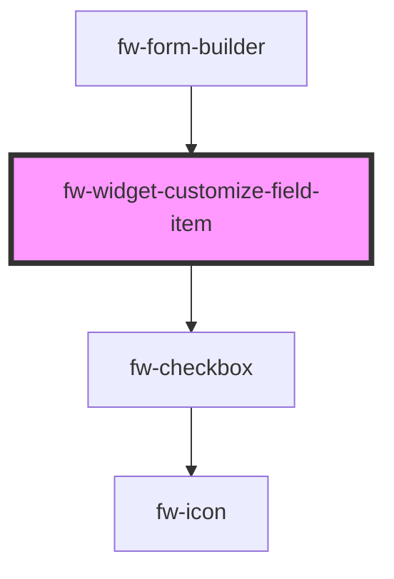

# Form Builder (fw-field-type-menu-item)

<!-- Auto Generated Below -->

## Properties

| Property         | Attribute          | Description                                                                                                | Type                      | Default     |
| ---------------- | ------------------ | ---------------------------------------------------------------------------------------------------------- | ------------------------- | ----------- |
| `dataProvider`   | `data-provider`    | data source used to set and edit the field values                                                          | `any`                     | `null`      |
| `disabled`       | `disabled`         | Disables the component on the interface. If the attribute’s value is undefined, the value is set to false. | `boolean`                 | `false`     |
| `index`          | `index`            | index attached inside the parent group component                                                           | `number`                  | `-1`        |
| `isPrimaryField` | `is-primary-field` | defines if the field is primary                                                                            | `boolean`                 | `false`     |
| `label`          | `label`            | Label displayed as header in the card.                                                                     | `string`                  | `''`        |
| `name`           | `name`             | Name of the component, saved as part of the form data.                                                     | `string`                  | `''`        |
| `pinned`         | `pinned`           | Pinned position of the drag item, other drag item cannot be placed above or below it.                      | `"" \| "bottom" \| "top"` | `undefined` |
| `selected`       | `selected`         | selected property of the component                                                                         | `boolean`                 | `false`     |

## Events

| Event     | Description                                   | Type               |
| --------- | --------------------------------------------- | ------------------ |
| `fwCheck` | Triggered when the card in focus is selected. | `CustomEvent<any>` |

## Dependencies

### Used by

- [fw-form-builder](.)

### Depends on

- fw-checkbox

### Graph

---

_Built with [StencilJS](https://stenciljs.com/)_
