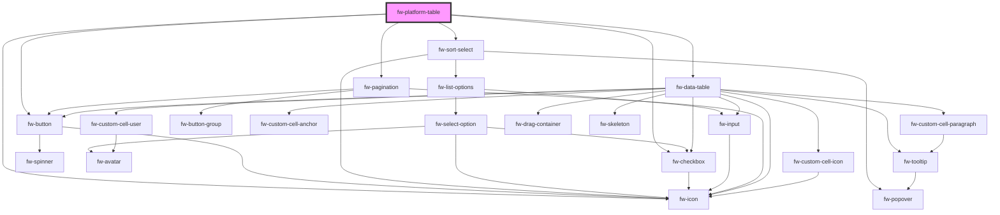

# Platform Table (fw-platform-table)

An extension of crayons fw--data-table with pagination and sort features.

## Sorting

`fwSort` event will be triggered whenever the user selects the sort by or the order by option in the dropdown.
The event detail will be of format `{orderBy : <unique ID of the Column to be sorted>, order: <asc or desc>}`.
The sortable columns are set via the prop sortableColumns of format `{ COLUMN_1_KEY : { text : COLUMN_1_NAME }}, ...`

## Pagination

`fwPagination` event will be triggered whenever the user click on the page navigation button.
The event detail will provide the page number `{page : <page number user wants to navigate>}`.

## Deleting Rows

`fwDelete` event will be triggered whenever the user click on the delete button.
The event detail will provide an array of selected rows unique id's `{selectedRows : <Array of string>}`.

## Demo

```html live
<fw-platform-table id="table"> </fw-platform-table>
<script type="application/javascript">
  var data = {
    columns: [
      {
        key: 'name',
        text: 'Name',
      },
      {
        key: 'group',
        text: 'Group',
      },
      {
        key: 'role',
        text: 'Role',
      },
    ],
    persons: [
      {
        id: '1234',
        name: 'Alexander Goodman',
        role: 'Administrator',
        group: 'L1 Support',
      },
      {
        id: '2345',
        name: 'Ambrose Wayne',
        role: 'Supervisor',
        group: 'L1 Support',
      },
      {
        id: '3456',
        name: 'August hines',
        role: 'Agent',
        group: 'L1 support',
      },
    ],
  };
  var sortableColumns = {
    role: { text: 'Role' },
    group: { text: 'Group' },
  };
  var table = document.getElementById('table');
  table.tableProps = { columns: data.columns, rows: data.persons };

  // Props for setting the sortable column and the default sorted column and its order 'ASC' or 'DSC'
  table.sortableColumns = sortableColumns;
  table.orderBy = 'role';
  table.order = 'ASC';
  table.paginationProps = { page: '1', perPage: '10', total: '1' };

  // To delete the row - fwDelete will be triggered whenever user click on delete button
  // Use your logic here to remove the data from the row
  table.addEventListener('fwDelete', (e) => {
    console.log(e.detail.selectedRows);
  });

  // To sort the data - fwSort will be triggered whenever user click on sort button
  // Use your logic here to sort the data
  table.addEventListener('fwSort', (e) => {
    console.log(e.detail);
  });
</script>
```

<!-- Auto Generated Below -->

## Properties

| Property          | Attribute       | Description                                       | Type      | Default     |
| ----------------- | --------------- | ------------------------------------------------- | --------- | ----------- |
| `isSelectable`    | `is-selectable` | Whether the checkbox should be visible.           | `boolean` | `true`      |
| `loading`         | `loading`       | The sort order.                                   | `boolean` | `false`     |
| `order`           | `order`         | The sort order.                                   | `any`     | `undefined` |
| `orderBy`         | `order-by`      | The sort by column key.                           | `any`     | `undefined` |
| `paginationProps` | --              | Props for the fw-pagination component             | `{}`      | `{}`        |
| `showError`       | `show-error`    | When set true the error state slot will be shown. | `boolean` | `false`     |
| `sortableColumns` | --              | The sortable columns object.                      | `{}`      | `{}`        |
| `tableProps`      | --              | Props for the fw-pagination component             | `{}`      | `{}`        |

## Events

| Event          | Description                                | Type               |
| -------------- | ------------------------------------------ | ------------------ |
| `fwDelete`     | Triggered on selecting the sort option.    | `CustomEvent<any>` |
| `fwPagination` | Triggered on page navigation button click. | `CustomEvent<any>` |

## Methods

### `clearTableSelection() => Promise<void>`

clears the selected rows in the table.

#### Returns

Type: `Promise<void>`

## Dependencies

### Depends on

- fw-button
- fw-icon
- [fw-sort-select](sort-select)
- fw-checkbox
- fw-pagination
- fw-data-table

### Graph



---

_Built with [StencilJS](https://stenciljs.com/)_
