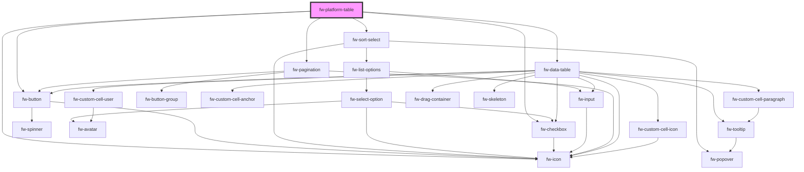

# Platform Table (fw-platform-table)

An extension of crayons fw--data-table with pagination and sort features.

## Sorting

`fwSort` event will be triggered whenever the user selects the sort by or the order by option in the dropdown.
The event detail will be of format `{orderBy : <unique ID of the Column to be sorted>, order: <asc or desc>}`.
The sortable columns are set via the prop sortableColumns of format `{ COLUMN_1_KEY : { text : COLUMN_1_NAME }}, ...`

## Pagination

`fwPagination` event will be triggered whenever the user click on the page navigation button.
The event detail will provide the page number `{page : <page number user wants to navigate>}`.

## Deleting Rows

`fwDelete` event will be triggered whenever the user click on the delete button.
The event detail will provide an array of selected rows unique id's `{selectedRows : <Array of string>}`.

## Demo

A simple data table is shown below

```html live
<fw-platform-table id="table"> </fw-platform-table>
<script type="application/javascript">
  var data = {
    columns: [
      {
        key: 'name',
        text: 'Name',
      },
      {
        key: 'group',
        text: 'Group',
      },
      {
        key: 'role',
        text: 'Role',
      },
    ],
    persons: [
      {
        id: '1234',
        name: 'Alexander Goodman',
        role: 'Administrator',
        group: 'L1 Support',
      },
      {
        id: '2345',
        name: 'Ambrose Wayne',
        role: 'Supervisor',
        group: 'L1 Support',
      },
      {
        id: '3456',
        name: 'August hines',
        role: 'Agent',
        group: 'L1 support',
      },
    ],
  };
  var sortableColumns = {
    role: { text: 'Role' },
    group: { text: 'Group' },
  };
  var table = document.getElementById('table');
  table.tableProps = { columns: data.columns, rows: data.persons };

  // Props for setting the sortable column and the default sorted column and its order 'ASC' or 'DSC'
  table.sortableColumns = sortableColumns;
  table.orderBy = 'role';
  table.order = 'ASC';
  table.paginationProps = { page: '1', perPage: '10', total: '1' };

  // To delete the row - fwDelete will be triggered whenever user click on delete button
  // Use your logic here to remove the data from the row
  table.addEventListener('fwDelete', (e) => {
    console.log(e.detail.selectedRows);
  });

  // To sort the data - fwSort will be triggered whenever user click on sort button
  // Use your logic here to sort the data
  table.addEventListener('fwSort', (e) => {
    console.log(e.detail);
  });
</script>
```

A complex table can be created using slots

```html live
<div>
  <fw-platform-table id="complex-table">
    <fw-input
      id="search-bar"
      slot="toolbar-before"
      placeholder="Search"
      icon-left="search"
      clear-input
    ></fw-input>
    <fw-button
      id="filter-button"
      size="normal"
      slot="toolbar-after"
      color="secondary"
      style="--fw-button-min-width: 32px;"
    >
      <fw-icon slot="before-label" name="filter"></fw-icon>
    </fw-button>
  </fw-platform-table>
  <fw-modal id="filter-slider" slider="true">
    <fw-modal-title>Filter Character</fw-modal-title>
    <fw-modal-content>
      <fw-filter id="filter">
        <div slot="filter-empty-state">No Filter selected</div>
      </fw-filter>
    </fw-modal-content>
    <fw-modal-footer>
      <fw-button id="reset" color="secondary">Reset</fw-button>
      <fw-button id="apply">Apply</fw-button>
    </fw-modal-footer>
  </fw-modal>
</div>
<script type="application/javascript">
  var charactersSource = [
    {
      id: 1,
      name: 'Aang',
      gender: 'Male',
      ethnicity: 'Air Nomad',
      weapon: 'The elements',
    },
    {
      id: 2,
      name: 'Appa',
      gender: 'Male',
      ethnicity: 'Air Nomad',
      weapon: 'Airbending',
    },
    {
      id: 3,
      name: 'Katara',
      gender: 'Female',
      ethnicity: 'Water Tribe',
      weapon: 'Waterbending',
    },
    {
      id: 4,
      name: 'Sokka',
      gender: 'Male',
      ethnicity: 'Water Tribe',
      weapon: 'Boomerang',
    },
    {
      id: 5,
      name: 'Toph Beifong',
      gender: 'Female',
      ethnicity: 'Earth Kingdom',
      weapon: 'Earthbending',
    },
    {
      id: 6,
      name: 'Iroh',
      gender: 'Male',
      ethnicity: 'Fire Nation',
      weapon: 'Firebending',
    },
    {
      id: 7,
      name: 'Bumi',
      gender: 'Male',
      ethnicity: 'Earth Kingdom',
      weapon: 'Earthbending',
    },
    {
      id: 8,
      name: 'Zuko',
      gender: 'Male',
      ethnicity: 'Fire Nation',
      weapon: 'Firebending',
    },
    {
      id: 9,
      name: 'Azula',
      gender: 'Female',
      ethnicity: 'Fire Nation',
      weapon: 'Firebending',
    },
  ];

  characters = charactersSource.sort((x) => (x.gender === 'Male' ? 1 : -1));
  var columns = [
    {
      key: 'name',
      text: 'Name',
    },
    {
      key: 'gender',
      text: 'Gender',
    },
    {
      key: 'ethnicity',
      text: 'Ethnicity',
    },
    {
      key: 'weapon',
      text: 'Style',
    },
  ];
  var sortableColumns = {
    ethnicity: { text: 'Ethnicity' },
    gender: { text: 'Gender' },
    weapon: { text: 'Style' },
  };

  var gender = [
    { text: 'Male', value: 'male' },
    { text: 'Female', value: 'female' },
  ];
  var ethnicityData = [
    { text: 'Fire Nation', value: '1' },
    { text: 'Earth Kingdom', value: '2' },
    { text: 'Water Tribe', value: '3' },
    { text: 'Air Nomad', value: '4' },
  ];

  var conditionSchema = {
    text: {
      equals: { text: '=', type: 'TEXT', default: true },
      is_empty: { text: 'Is empty' },
    },
    dropdown: {
      equals: {
        text: 'is',
        type: 'DROPDOWN',
        default: true,
      },
      is_empty: { text: 'Is empty' },
    },
    multiSelect: {
      equals: {
        text: 'is',
        type: 'MULTI_SELECT',
        default: true,
      },
    },
  };

  var filterSchema = {
    name: { text: 'Name', type: 'text' },
    gender: {
      text: 'Gender',
      type: 'dropdown',
      controlProps: { options: gender, placeholder: 'choose a gender' },
    },
    ethnicity: {
      text: 'Ethnicity',
      type: 'multiSelect',
      controlProps: { options: ethnicityData },
    },
  };

  var complexTable = document.getElementById('complex-table');
  complexTable.tableProps = { columns: columns, rows: characters.slice(0, 5) };

  // Props for setting the sortable column and the default sorted column and its order 'ASC' or 'DSC'
  complexTable.sortableColumns = sortableColumns;
  complexTable.orderBy = 'gender';
  complexTable.order = 'ASC';
  complexTable.paginationProps = { page: '1', perPage: '5', total: '10' };

  // To delete the row - fwDelete will be triggered whenever user click on delete button
  // Use your logic here to remove the data from the row
  complexTable.addEventListener('fwDelete', (e) => {
    console.log(e.detail.selectedRows);
  });

  // To sort the data - fwSort will be triggered whenever user click on sort button
  complexTable.addEventListener('fwSort', (e) => {
    console.log(e.detail);
    // A sample logic here to sort the data. Replace it with your own logic if needed
    const { orderBy, order } = e.detail;
    characters = characters.sort((a, b) =>
      order === 'ASC'
        ? a[orderBy].localeCompare(b[orderBy])
        : b[orderBy].localeCompare(a[orderBy])
    );
    complexTable.tableProps = {
      columns: columns,
      rows: characters.slice(0, 5),
    };
  });

  // fwPagination will be triggered whenever user navigates the pagination button
  complexTable.addEventListener('fwPagination', (e) => {
    console.log(e.detail);
    // A sample logic here for pagination. Replace it with your own logic if needed
    if (e.detail.page == 2) {
      complexTable.tableProps = {
        columns: columns,
        rows: characters.slice(5, 10),
      };
      return;
    }
    complexTable.tableProps = {
      columns: columns,
      rows: characters.slice(0, 5),
    };
  });

  // To search the data - fwInput will be triggered whenever types in the search bar
  // Use your logic here to search/filter the data
  document.getElementById('search-bar').addEventListener('fwInput', (e) => {
    console.log(e.detail);
  });
  // fwInputClear will be triggered whenever the user cancles the search, use this
  // event to clear or reset the search
  document
    .getElementById('search-bar')
    .addEventListener('fwInputClear', (e) => {
      console.log(e.detail);
    });

  // Wring up logic for fw-filter
  filterSlider = document.getElementById('filter-slider');
  filter = document.getElementById('filter');
  filterButton = document.getElementById('filter-button');
  node = document.createElement('span');

  //Setting the data for the filter
  filter.conditionSchema = conditionSchema;
  filter.filters = filterSchema;
  filter.addEventListener('fwFilterChange', (e) => {
    console.log(e.detail);
  });

  filterButton.addEventListener('fwClick', (e) => {
    // Open the filter
    filterSlider.open();
  });

  // Listen to sumbit event in the filter. This will be triggered when the user click on
  // the Apply button inside the slider.
  document.getElementById('apply').addEventListener('click', () => {
    //Get the value from the filter
    filter
      .getValue()
      .then((filterValue) => {
        console.log(filterValue);
        let filterCount = Object.keys(filterValue).length;
        if (filterCount > 0) {
          // Display the filter count
          node.innerText = `(${filterCount})`;
          filterButton.appendChild(node);

          // Logic to filter the data
          conditions = [];
          for (const key in filterValue) {
            let value = '';
            if (typeof filterValue[key].value === 'string') {
              value = filterValue[key].value;
            } else {
              value = filterValue[key].value.map((x) => x.text);
            }
            conditions.push({
              key,
              value,
              operation: filterValue[key].condition,
            });
          }
          characters = characters.filter((x) => {
            const matches = conditions.filter((condition) => {
              const { key, value, operation } = condition;
              return typeof value === 'string'
                ? compareString(x[key], value, operation)
                : compareContains(x[key], value, operation);
            });
            return matches.length === conditions.length;
          });

          complexTable.tableProps = {
            columns: columns,
            rows: characters.slice(0, 5),
          };
        } else {
          // Remove the filter count
          filterButton.lastChild.remove();
        }
      })
      // catch error in the filter
      .catch((e) => console.log(e));

    //Close the slider
    filterSlider.close();
  });

  // Logic to clear the filter
  document.getElementById('reset').addEventListener('click', (e) => {
    console.log('clear');
    // Clear the filter
    filter.clearFilter();

    // Reset the table data
    characters = charactersSource.sort((x) => (x.gender === 'Male' ? 1 : -1));
    complexTable.tableProps = {
      columns: columns,
      rows: characters.slice(0, 5),
    };

    // Remove the filter count
    filterButton.lastChild.remove();

    // Close the slider
    filterSlider.close();
  });

  // Filter Helper functions

  function compareString(source, target, condition) {
    if (condition === 'equals') {
      return source === target;
    } else if (condition === 'is_empty') {
      return source === '';
    }
  }

  function compareContains(source, target, condition) {
    if (condition === 'equals') {
      return target.includes(source);
    } else if (condition === 'is_empty') {
      return source === '';
    }
  }
</script>
```

<!-- Auto Generated Below -->

## Properties

| Property          | Attribute       | Description                                       | Type      | Default     |
| ----------------- | --------------- | ------------------------------------------------- | --------- | ----------- |
| `isSelectable`    | `is-selectable` | Whether the checkbox should be visible.           | `boolean` | `true`      |
| `loading`         | `loading`       | The sort order.                                   | `boolean` | `false`     |
| `order`           | `order`         | The sort order.                                   | `any`     | `undefined` |
| `orderBy`         | `order-by`      | The sort by column key.                           | `any`     | `undefined` |
| `paginationProps` | --              | Props for the fw-pagination component             | `{}`      | `{}`        |
| `showError`       | `show-error`    | When set true the error state slot will be shown. | `boolean` | `false`     |
| `sortableColumns` | --              | The sortable columns object.                      | `{}`      | `{}`        |
| `tableProps`      | --              | Props for the fw-pagination component             | `{}`      | `{}`        |

## Events

| Event          | Description                                | Type               |
| -------------- | ------------------------------------------ | ------------------ |
| `fwDelete`     | Triggered on selecting the sort option.    | `CustomEvent<any>` |
| `fwPagination` | Triggered on page navigation button click. | `CustomEvent<any>` |

## Methods

### `clearTableSelection() => Promise<void>`

clears the selected rows in the table.

#### Returns

Type: `Promise<void>`

## Dependencies

### Depends on

- fw-button
- fw-icon
- [fw-sort-select](sort-select)
- fw-checkbox
- fw-pagination
- fw-data-table

### Graph



---

Built with ❤ at Freshworks
