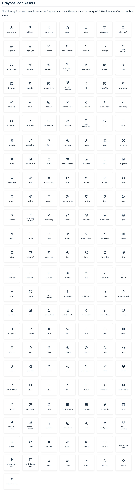
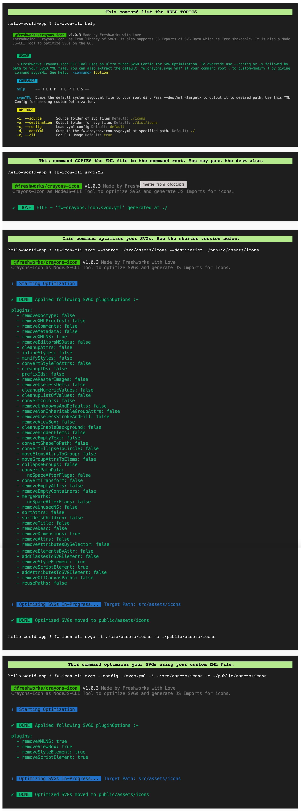

 ![Built With Stencil](https://img.shields.io/badge/-Built%20With%20Stencil-16161d.svg?logo=data%3Aimage%2Fsvg%2Bxml%3Bbase64%2CPD94bWwgdmVyc2lvbj0iMS4wIiBlbmNvZGluZz0idXRmLTgiPz4KPCEtLSBHZW5lcmF0b3I6IEFkb2JlIElsbHVzdHJhdG9yIDE5LjIuMSwgU1ZHIEV4cG9ydCBQbHVnLUluIC4gU1ZHIFZlcnNpb246IDYuMDAgQnVpbGQgMCkgIC0tPgo8c3ZnIHZlcnNpb249IjEuMSIgaWQ9IkxheWVyXzEiIHhtbG5zPSJodHRwOi8vd3d3LnczLm9yZy8yMDAwL3N2ZyIgeG1sbnM6eGxpbms9Imh0dHA6Ly93d3cudzMub3JnLzE5OTkveGxpbmsiIHg9IjBweCIgeT0iMHB4IgoJIHZpZXdCb3g9IjAgMCA1MTIgNTEyIiBzdHlsZT0iZW5hYmxlLWJhY2tncm91bmQ6bmV3IDAgMCA1MTIgNTEyOyIgeG1sOnNwYWNlPSJwcmVzZXJ2ZSI%2BCjxzdHlsZSB0eXBlPSJ0ZXh0L2NzcyI%2BCgkuc3Qwe2ZpbGw6I0ZGRkZGRjt9Cjwvc3R5bGU%2BCjxwYXRoIGNsYXNzPSJzdDAiIGQ9Ik00MjQuNywzNzMuOWMwLDM3LjYtNTUuMSw2OC42LTkyLjcsNjguNkgxODAuNGMtMzcuOSwwLTkyLjctMzAuNy05Mi43LTY4LjZ2LTMuNmgzMzYuOVYzNzMuOXoiLz4KPHBhdGggY2xhc3M9InN0MCIgZD0iTTQyNC43LDI5Mi4xSDE4MC40Yy0zNy42LDAtOTIuNy0zMS05Mi43LTY4LjZ2LTMuNkgzMzJjMzcuNiwwLDkyLjcsMzEsOTIuNyw2OC42VjI5Mi4xeiIvPgo8cGF0aCBjbGFzcz0ic3QwIiBkPSJNNDI0LjcsMTQxLjdIODcuN3YtMy42YzAtMzcuNiw1NC44LTY4LjYsOTIuNy02OC42SDMzMmMzNy45LDAsOTIuNywzMC43LDkyLjcsNjguNlYxNDEuN3oiLz4KPC9zdmc%2BCg%3D%3D&colorA=16161d&style=flat-square)    [](https://www.jsdelivr.com/package/npm/@freshworks/crayons-icon)
# Icon Library (@freshworks/crayons-icon)

**Freshworks Crayons** publishes `@freshworks/crayons-icon` as an `Icon Library`. Following features are made available to users via the Lib utils.

1. Optimized set of Crayons Icons in `dist/icons` path. You are free to use them for project related purposes.
2. `Crayons` SVG Icons are also available as an esm module. Supports Tree-Shaking. This is a useful feature especially for customization purposes.
3. Enables `@freshworks/crayons-icon` CLI Interface via which you can leverage the SVGO Tooling to optimize your project svg-icons.
4. Crayons Iconlib default `svgo config` (svg compression util) is available as part of `dist` folder. Refer usage docs on how to use it in your project.

<details> 
  <summary>Click to see the List of Icon Assets available as part of Repo.</summary>
   
</details>

## Importing Icons from '@freshworks/crayons-icon'. [ Supports Tree-Shaking ].

You can also import Crayons Icons as an esm Module.

1. HTML USAGE

```html
<html>
<head>
   <script type="module" src="https://unpkg.com/@freshworks/crayons@canary/dist/crayons/crayons.esm.js" ></script>
   <script type="module">
        import { header, add_contact } from '@freshworks/crayons-icon';
   </script>
</head>   
<body>
      <div>
        <fw-icon data-svg={ header } label="Header" />
        <fw-icon data-svg={ add_contact } label="Add-Contact" />
      </div>
</body>
</html>
```

2. REACTJS USAGE

```js
import React from 'react';
import { FwIcon } from '@freshworks/crayons/react'; 
import { header, add_contact } from '@freshworks/crayons-icon';

function App() {
    return ( 
        <div>
            <FwIcon dataSvg={ header } label="Header"/>
            <FwIcon dataSvg={ add_contact } label="Add-Contact"/>
        </div>
    );
}
export default App;
```

## CLI Tool for processing SVGs

`@freshworks/crayons-icon` is also available as a CLI Tool for processing SVGs with a friendlier interface, options and easily customizable config to optimize your SVGs. See the usage below. 
It comes packed with a ultra tuned svgo-config. We support YML Config convention as its better in readability and easy to modify than a JSON. You may use the in-built CLI command to get the default YML File at your command root/ desired location, which you can further customize and use to optimze your SVGs via this CLI Tool.

<details> 
  <summary>Click to see the List of Sample CLI commands with Output.</summary>
    
</details>

----------------------------------------------

Built with ❤ at Freshworks
