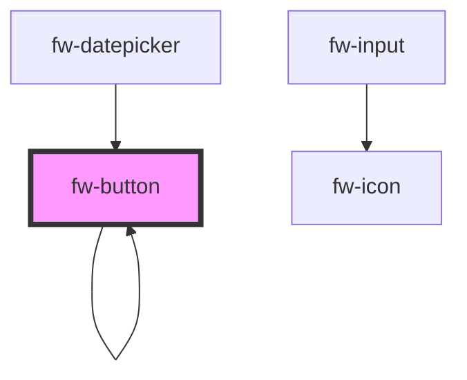

# Button (fw-button)
fw-button displays a button on the user interface and enables performing specific actions based on the button type. The button’s label can be a text, icon, or both.

## Usage

```html live
<section>
<fw-label value="Try themes"></fw-label>
<fw-button color="secondary"> OK </fw-button>
<fw-button color="danger"> Don't Click </fw-button>
<fw-button color="link"> Link Button </fw-button>
<fw-button color="text"> Plain Text Button </fw-button>
</section>
<br>
<section>
<fw-label value="Try sizes"></fw-label>
<fw-button size="small"> Small </fw-button>
<fw-button size="mini" color="secondary"> Mini </fw-button>
</section>
<br>
<section>
<fw-label value="Try icon buttons"></fw-label>
<fw-button size="icon"><fw-icon name="agent" color="white"></fw-icon> </fw-button>
<fw-button size="icon" color="secondary"><fw-icon name="phone"></fw-icon> </fw-button>
</section>
<br>
<section>
<fw-label value="Try icon + text buttons"></fw-label>
<fw-button color="secondary"><fw-icon name="delete"></fw-icon> Delete</fw-button>
<fw-button color="primary"> Copy <fw-icon name="code" color="white"></fw-icon></fw-button>
</section>
<br>
<section>
<fw-label value="Try expand attribute"></fw-label>
<fw-button size="small" color="secondary" expand>Span full-width</fw-button>
</section>
```


<!-- Auto Generated Below -->


## Properties

| Property      | Attribute     | Description                                                                                              | Type                                                       | Default     |
| ------------- | ------------- | -------------------------------------------------------------------------------------------------------- | ---------------------------------------------------------- | ----------- |
| `color`       | `color`       | Identifier of  the theme based on which the button is styled.                                            | `"danger" or "link" or "primary" or "secondary" or "text"` | `'primary'` |
| `disabled`    | `disabled`    | Disables the button on the interface. If the attribute’s value is undefined, the value is set to false.  | `boolean`                                                  | `false`     |
| `dropdown`    | `dropdown`    | Displays a dropdown button                                                                               | `boolean`                                                  | `false`     |
| `expand`      | `expand`      | Sets the button to a full-width block. If the attribute’s value is undefined, the value is set to false. | `boolean`                                                  | `false`     |
| `modalTriggerId` | `modal-trigger-id` | Accepts the id of the fw-modal component to open it on click                                             | `string`                                                   | `''`        |
| `placeholder` | `placeholder` | Placeholder text for search input. Validated only if dropdown and searchable is true                     | `string`                                                   | `''`        |
| `searchable`  | `searchable`  | Displays a searchable dropdown button                                                                    | `boolean`                                                  | `false`     |
| `size`        | `size`        | Size of the button.                                                                                      | `"mini" or "normal" or "small"`                            | `'normal'`  |
| `split`       | `split`       | Displays a split dropdown button                                                                         | `boolean`                                                  | `false`     |
| `type`        | `type`        | Button type based on which actions are performed when the button is clicked.                             | `"button" or "reset" or "submit"`                          | `'button'`  |
| `value`       | `value`       | Value of the dropdown button                                                                             | `any`                                                      | `undefined` |


## Events

| Event           | Description                                 | Type                |
| --------------- | ------------------------------------------- | ------------------- |
| `fwBlur`        | Triggered when the button loses focus.      | `CustomEvent<void>` |
| `fwClick`       | Triggered when the button is clicked.       | `CustomEvent<void>` |
| `fwFocus`       | Triggered when the button comes into focus. | `CustomEvent<void>` |
| `fwOptionClick` | Triggered when an option is clicked         | `CustomEvent<void>` |
| `fwOptionsAdd`  | Triggered when an option is clicked         | `CustomEvent<void>` |


## CSS Custom Properties

| Name                    | Description                       |
| ----------------------- | --------------------------------- |
| `--dropdown-font-size`  | Dropdown item font size in pixels |
| `--dropdown-max-height` | Dropdown maximum height in pixels |
| `--dropdown-max-width`  | Dropdown maximum width in pixels  |
| `--dropdown-min-height` | Dropdown minimum height in pixels |
| `--dropdown-min-width`  | Dropdown minimum width in pixels  |


## Dependencies

### Used by

 - [fw-button](.)
 - [fw-datepicker](../datepicker)

### Depends on

- [fw-icon](../icon)
- [fw-checkbox](../checkbox)
- [fw-input](../input)
- [fw-button](.)

### Graph


----------------------------------------------

Built with ❤ at Freshworks
