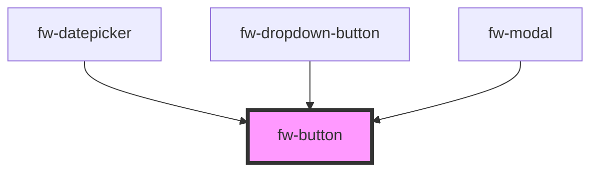

# Button (fw-button)
fw-button displays a button on the user interface and enables performing specific actions based on the button type. The button’s label can be a text, icon, or both.

## Usage

```html live
<section>
<fw-label value="Try themes"></fw-label>
<fw-button color="secondary"> OK </fw-button>
<fw-button color="danger"> Don't Click </fw-button>
<fw-button color="link"> Link Button </fw-button>
<fw-button color="text"> Plain Text Button </fw-button>
</section>
<br>
<section>
<fw-label value="Try sizes"></fw-label>
<fw-button size="small"> Small </fw-button>
<fw-button size="mini" color="secondary"> Mini </fw-button>
</section>
<br>
<section>
<fw-label value="Try icon buttons"></fw-label>
<fw-button size="icon"><fw-icon name="agent" color="white"></fw-icon> </fw-button>
<fw-button size="icon" color="secondary"><fw-icon name="phone"></fw-icon> </fw-button>
</section>
<br>
<section>
<fw-label value="Try icon + text buttons"></fw-label>
<fw-button color="secondary"><fw-icon name="delete"></fw-icon> Delete</fw-button>
<fw-button color="primary"> Copy <fw-icon name="code" color="white"></fw-icon></fw-button>
</section>
<br>
<section>
<fw-label value="Try expand attribute"></fw-label>
<fw-button size="small" color="secondary" expand>Span full-width</fw-button>
</section>
```


<!-- Auto Generated Below -->


## Properties

| Property         | Attribute          | Description                                                                                              | Type      | Default     |
| ---------------- | ------------------ | -------------------------------------------------------------------------------------------------------- | --------- | ----------- |
| `color`          | `color`            | Identifier of  the theme based on which the button is styled.                                            | `string`  | `'primary'` |
| `disabled`       | `disabled`         | Disables the button on the interface. If the attribute’s value is undefined, the value is set to false.  | `boolean` | `false`     |
| `expand`         | `expand`           | Sets the button to a full-width block. If the attribute’s value is undefined, the value is set to false. | `boolean` | `false`     |
| `modalTriggerId` | `modal-trigger-id` | Accepts the id of the fw-modal component to open it on click                                             | `string`  | `''`        |
| `size`           | `size`             | Size of the button.                                                                                      | `string`  | `'normal'`  |
| `type`           | `type`             | Button type based on which actions are performed when the button is clicked.                             | `string`  | `'button'`  |


## Events

| Event     | Description                                 | Type                |
| --------- | ------------------------------------------- | ------------------- |
| `fwBlur`  | Triggered when the button loses focus.      | `CustomEvent<void>` |
| `fwClick` | Triggered when the button is clicked.       | `CustomEvent<void>` |
| `fwFocus` | Triggered when the button comes into focus. | `CustomEvent<void>` |


## Dependencies

### Used by

 - [fw-datepicker](../datepicker)
 - [fw-dropdown-button](../dropdown-button)
 - [fw-modal](../modal)

### Graph


----------------------------------------------

Built with ❤ at Freshworks
