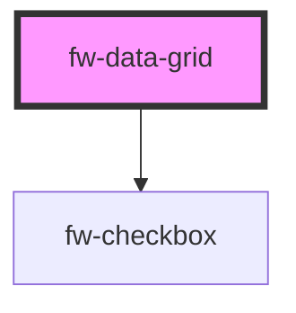

# DataGrid (fw-data-grid)
fw-data-grid are used for data visualization.

## Usage

```html live
<template>
  <!-- 
    In HTML we cannot pass objects as attributes to custom elements. 
    So, here vue template is used to load data into datagrid for demo purposes. 
    You must use fw-data-grid like in example below incase of React/Stencil projects:
    <fw-data-grid columns={headers} rows={persons} isSelectable></fw-data-grid>
  -->
  <fw-data-grid ref="datagrid"></fw-data-grid>
</template>

<script>
export default {
  data() {
    return {
      headers: [{
        "key": "name",
        "text": "Name",
        "orderIndex": 1
      }, {
        "key": "group",
        "text": "Group",
        "orderIndex": 3
      }, {
        "key": "role",
        "text": "Role",
        "orderIndex": 2
      }],
      persons: [{
        "id": 1234,
        "name": "Alexander Goodman", 
        "role": "Administrator", 
        "group": "L1 Support"
      }, {
        "id": 2345,
        "name": "Ambrose Wayne", 
        "role": "Supervisor", 
        "group": "L1 Support"
      }, {
        "id": 3456,
        "name": "August hines",
        "role": "Agent",
        "group": "L1 support"
      }],
      isSelectable: true,
      label: "Hello world"
    }
  },
  mounted() {
    this.$refs.datagrid.columns = this.headers;
    this.$refs.datagrid.rows = this.persons;
    this.$refs.datagrid.isSelectable = this.isSelectable;
    this.$refs.datagrid.label = this.label;
  }
};
</script>
```

<!-- Auto Generated Below -->


## Properties

| Property       | Attribute       | Description                                                                            | Type       | Default |
| -------------- | --------------- | -------------------------------------------------------------------------------------- | ---------- | ------- |
| `columns`      | --              | Columns Array of objects that provides information regarding the columns in the table. | `Column[]` | `[]`    |
| `isSelectable` | `is-selectable` | isSelectable Boolean based on which selectable options appears for rows in the table.  | `boolean`  | `false` |
| `label`        | `label`         | Label attribute is not visible on screen. There for accessibility purposes.            | `string`   | `''`    |
| `rows`         | --              | Rows Array of objects to be displayed in the table.                                    | `Row[]`    | `[]`    |


## Events

| Event               | Description                                                         | Type               |
| ------------------- | ------------------------------------------------------------------- | ------------------ |
| `fwSelectionChange` | fwSelectionChange Emits this event when row is selected/unselected. | `CustomEvent<any>` |


## Dependencies

### Depends on

- [fw-checkbox](../checkbox)

### Graph


----------------------------------------------

Built with ❤ at Freshworks
