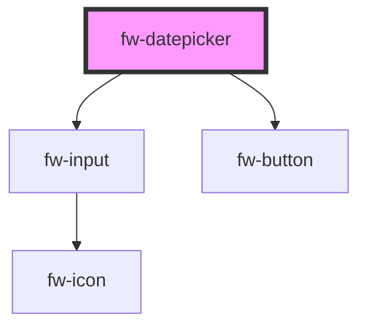

# fw-datepicker

<!-- Auto Generated Below -->

## Properties

| Property      | Attribute     | Description | Type     | Default     |
| ------------- | ------------- | ----------- | -------- | ----------- |
| `dateFormat`  | `date-format` |             | `string` | `undefined` |
| `dateValue`   | `date-value`  |             | `any`    | `undefined` |
| `endDate`     | `end-date`    |             | `any`    | `undefined` |
| `maxDate`     | `max-date`    |             | `any`    | `undefined` |
| `minDate`     | `min-date`    |             | `any`    | `undefined` |
| `mode`        | `mode`        |             | `string` | `undefined` |
| `placeholder` | `placeholder` |             | `string` | `undefined` |
| `startDate`   | `start-date`  |             | `any`    | `undefined` |

## Events

| Event      | Description | Type               |
| ---------- | ----------- | ------------------ |
| `fwChange` |             | `CustomEvent<any>` |

## Dependencies

### Depends on

- [fw-input](../input)
- [fw-button](../button)

### Graph

----------------------------------------------

Built with ❤ at Freshworks
