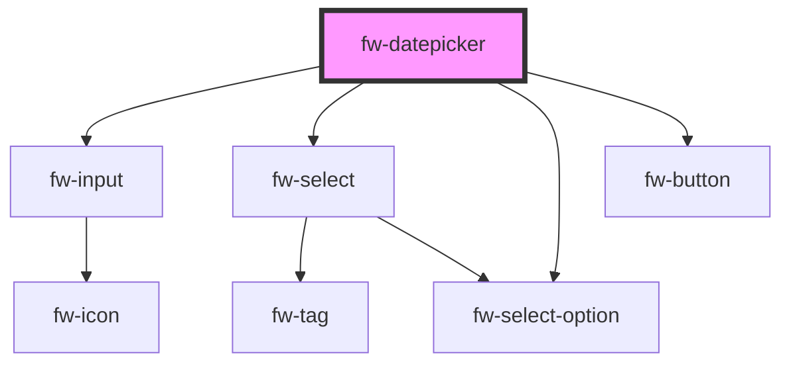

# fw-datepicker

<!-- Auto Generated Below -->

## Properties

| Property      | Attribute     | Description                                              | Type                       | Default         |
| ------------- | ------------- | -------------------------------------------------------- | -------------------------- | --------------- |
| `dateFormat`  | `date-format` | Selected Date will be retured in the given date format   | `string`                   | `'DD-MM-YYYY'`  |
| `fromDate`    | `from-date`   | From date that is selected in the date range picker mode | `string`                   | `undefined`     |
| `maxDate`     | `max-date`    | Maximum date that are allowed to select in the calender  | `string`                   | `undefined`     |
| `minDate`     | `min-date`    | Minimum date that are allowed to select in the calender  | `string`                   | `undefined`     |
| `mode`        | `mode`        | Shows single date or date range picker based on mode     | `"range" or "single date"` | `'single date'` |
| `placeholder` | `placeholder` | Placeholder to display in the input field                | `string`                   | `undefined`     |
| `toDate`      | `to-date`     | To date that is selected in the date range picker mode   | `string`                   | `undefined`     |
| `value`       | `value`       | Value selected in the single date picker mode            | `string`                   | `undefined`     |

## Events

| Event      | Description                              | Type               |
| ---------- | ---------------------------------------- | ------------------ |
| `fwChange` | Triggered when the update button clicked | `CustomEvent<any>` |

## Dependencies

### Depends on

- [fw-input](../input)
- [fw-select](../select)
- [fw-select-option](../select-option)
- [fw-button](../button)

### Graph

----------------------------------------------

Built with ❤ at Freshworks
