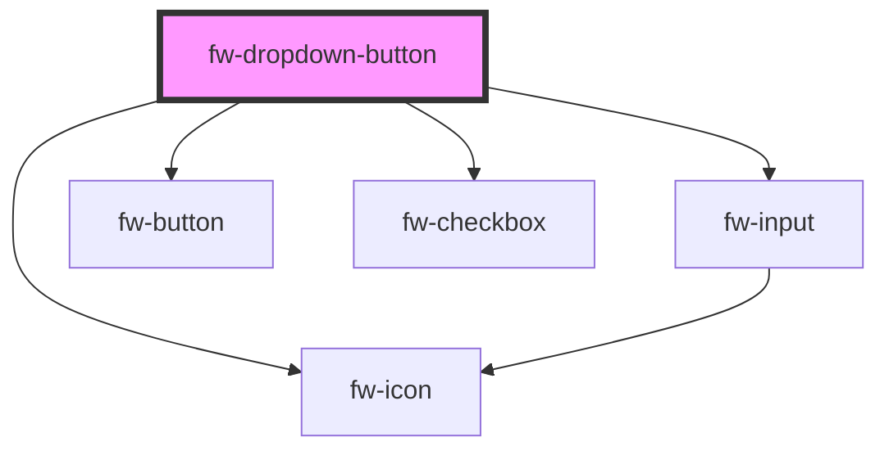

# Dropdown button (fw-dropdown-button)
fw-dropdown-button displays a dropdown button on the user interface and enables dropdding down options. It can also be searchable. For each option select, an event is triggered

## Usage
```html live
<fw-label color="blue" value="Normal dropdown button"></fw-label>
<br>
<fw-dropdown-button label="Choose the sport">
  <div slot="dropdown-options">
    <option id="1" value="Cricket">Cricket</option>
    <option id="2" value="Football">Football</option>
    <option id="3" value="Hockey">Hockey</option>
    <option id="4" value="Table tennis">Table tennis</option>
    <option id="5" value="Badminton">Badminton</option>
    <option id="6" value="Tennis">Tennis</option>
  </div>
</fw-dropdown-button>
<br><br>
<fw-label color="blue" value="Splittable dropdown button"></fw-label>
<br>
<fw-dropdown-button split color="secondary" label="Choose the sport">
  <div slot="dropdown-options">
    <option id="1" value="Cricket">Cricket</option>
    <option id="2" value="Football">Football</option>
    <option id="3" value="Hockey">Hockey</option>
    <option id="4" value="Table tennis">Table tennis</option>
    <option id="5" value="Badminton">Badminton</option>
    <option id="6" value="Tennis">Tennis</option>
  </div>
</fw-dropdown-button>
<br><br>
<fw-label color="blue" value="Searchable dropdown button"></fw-label>
<br>
<fw-dropdown-button searchable label="Sport" placeholder="Choose a sport">
  <div slot="dropdown-options">
    <option id="1" value="Cricket">Cricket</option>
    <option id="2" value="Football">Football</option>
    <option id="3" value="Hockey">Hockey</option>
    <option id="4" value="Table tennis">Table tennis</option>
    <option id="5" value="Badminton">Badminton</option>
    <option id="6" value="Tennis">Tennis</option>
  </div>
</fw-dropdown-button>
```

<!-- Auto Generated Below -->


## Properties

| Property      | Attribute     | Description                                                                          | Type                                                       | Default     |
| ------------- | ------------- | ------------------------------------------------------------------------------------ | ---------------------------------------------------------- | ----------- |
| `color`       | `color`       | Dropdown Button color                                                                | `"danger" \| "link" \| "primary" \| "secondary" \| "text"` | `'primary'` |
| `disabled`    | `disabled`    | Disables the dropdown button if its true                                             | `boolean`                                                  | `false`     |
| `label`       | `label`       | Label for the dropdown button                                                        | `string`                                                   | `undefined` |
| `options`     | --            | Options to show in the dropdown button                                               | `any[]`                                                    | `[]`        |
| `placeholder` | `placeholder` | Placeholder text for search input. Validated only if dropdown and searchable is true | `string`                                                   | `''`        |
| `searchable`  | `searchable`  | Displays a searchable dropdown button                                                | `boolean`                                                  | `false`     |
| `split`       | `split`       | Displays a split dropdown button                                                     | `boolean`                                                  | `false`     |
| `value`       | `value`       | Value of the dropdown button                                                         | `any`                                                      | `undefined` |


## Events

| Event           | Description                                                  | Type               |
| --------------- | ------------------------------------------------------------ | ------------------ |
| `fwOptionClick` | Triggered when an option is clicked                          | `CustomEvent<any>` |
| `fwOptionsAdd`  | Triggered when Add button for searchable dropdown is clicked | `CustomEvent<any>` |


## CSS Custom Properties

| Name                    | Description                       |
| ----------------------- | --------------------------------- |
| `--dropdown-font-size`  | Dropdown item font size in pixels |
| `--dropdown-max-height` | Dropdown maximum height in pixels |
| `--dropdown-max-width`  | Dropdown maximum width in pixels  |
| `--dropdown-min-height` | Dropdown minimum height in pixels |
| `--dropdown-min-width`  | Dropdown minimum width in pixels  |


## Dependencies

### Depends on

- [fw-icon](../icon)
- [fw-input](../input)
- [fw-button](../button)
- [fw-checkbox](../checkbox)

### Graph


----------------------------------------------

Built with ❤ at Freshworks
