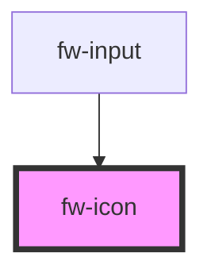

# Icon
Icon is an informational component that imparts meaning to the component it is associated with.
## Usage

```html live
<fw-icon name="add-contact" size="18" color="green"></fw-icon>
```

<!-- Auto Generated Below -->


## Properties

| Property | Attribute | Description                                 | Type     | Default     |
| -------- | --------- | ------------------------------------------- | -------- | ----------- |
| `color`  | `color`   | The color of the icon in CSS standard color | `string` | `''`        |
| `name`   | `name`    | The name of the icon                        | `string` | `undefined` |
| `size`   | `size`    | The size of the icon in pixels              | `number` | `12`        |


## CSS Custom Properties

| Name           | Description       |
| -------------- | ----------------- |
| `--icon-color` | Color of the icon |


## Dependencies

### Used by

 - [fw-input](../input)

### Graph


----------------------------------------------

Built with ❤ at Freshworks
