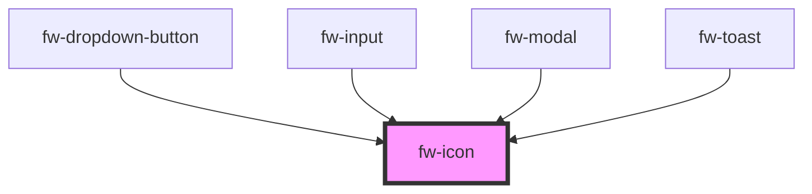

# Icon (fw-icon)
fw-icon displays an icon-sized image that imparts meaning to the component it is associated with.
## Usage

```html live
<fw-icon name="add-contact" size="18" color="green"></fw-icon>
```

### Icons

The following are the icons supported:

<IconGallery/>

<!-- Auto Generated Below -->


## Properties

| Property | Attribute | Description                                                                                                 | Type     | Default     |
| -------- | --------- | ----------------------------------------------------------------------------------------------------------- | -------- | ----------- |
| `color`  | `color`   | Color in which the icon is displayed, specified as a standard CSS color or as a HEX code.                   | `string` | `''`        |
| `name`   | `name`    | Identifier of the icon. The attribute’s value must be a valid svg file in the repo of icons (assets/icons). | `string` | `undefined` |
| `size`   | `size`    | Size of the icon, specified in number of  pixels.                                                           | `number` | `12`        |


## CSS Custom Properties

| Name           | Description       |
| -------------- | ----------------- |
| `--icon-color` | Color of the icon |


## Dependencies

### Used by

 - [fw-dropdown-button](../dropdown-button)
 - [fw-input](../input)
 - [fw-modal](../modal)
 - [fw-toast](../toast)

### Graph


----------------------------------------------

Built with ❤ at Freshworks
