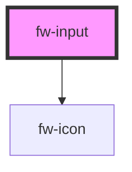

# Input (fw-input)
fw-input displays a single-line input box on the user interface and enables assigning a value to it. 

## Usage

```html live
<fw-input
  label="Name"
  icon-left="add-contact"
  state-text="Do not enter your user ID"
  state="warning"
  placeholder="Enter your official name"
  required
  clear-input>
</fw-input>
<fw-input
  label="Password"
  state-text="Password is incorrect"
  state="error"
  required
  clear-input>
</fw-input>
<fw-input
  label="Verification Code"
placeholder="Enter the verification code sent to the registered email address"
  state="normal"
  clear-input>
</fw-input>
<fw-input
  label="Deprecated Field"
  disabled
  state="normal"
  clear-input>
</fw-input>
<fw-input
  label="Do Not Modify"
  value="Not applicable"
  readonly
  state="normal"
  clear-input>
</fw-input>


```

<!-- Auto Generated Below -->


## Properties

| Property       | Attribute      | Description                                                                                                                                                                                                                                                                        | Type                               | Default     |
| -------------- | -------------- | ---------------------------------------------------------------------------------------------------------------------------------------------------------------------------------------------------------------------------------------------------------------------------------- | ---------------------------------- | ----------- |
| `autocomplete` | `autocomplete` | Specifies whether the browser can display suggestions to autocomplete the text value.                                                                                                                                                                                              | `"off" or "on"`                    | `'off'`     |
| `clearInput`   | `clear-input`  | Displays a right-justified clear icon in the text box. Clicking the icon clears the input text. If the attribute’s value is undefined, the value is set to true. For a read-only input box, the clear icon is not displayed unless a default value is specified for the input box. | `boolean`                          | `false`     |
| `disabled`     | `disabled`     | Disables the component on the interface. If the attribute’s value is undefined, the value is set to true.                                                                                                                                                                          | `boolean`                          | `false`     |
| `iconLeft`     | `icon-left`    | Identifier of the icon that is displayed in the left side of the text box. The attribute’s value must be a valid svg file in the repo of icons (assets/icons).                                                                                                                     | `string`                           | `undefined` |
| `iconRight`    | `icon-right`   | Identifier of the icon that is displayed in the right side of the text box. The attribute’s value must be a valid svg file in the repo of icons (assets/icons).                                                                                                                    | `string`                           | `undefined` |
| `label`        | `label`        | Label displayed on the interface, for the component.                                                                                                                                                                                                                               | `string`                           | `''`        |
| `maxlength`    | `maxlength`    | Maximum number of characters a user can enter in the text box.                                                                                                                                                                                                                     | `number`                           | `undefined` |
| `minlength`    | `minlength`    | Minimum number of characters a user must enter in the text box for the value to be valid.                                                                                                                                                                                          | `number`                           | `undefined` |
| `name`         | `name`         | Name of the component, saved as part of form data.                                                                                                                                                                                                                                 | `string`                           | `''`        |
| `placeholder`  | `placeholder`  | Text displayed in the text box before a user enters a value.                                                                                                                                                                                                                       | `string`                           | `undefined` |
| `readonly`     | `readonly`     | If true, the user cannot enter a value in the input box. If the attribute’s value is undefined, the value is set to true.                                                                                                                                                          | `boolean`                          | `false`     |
| `required`     | `required`     | Specifies the input box as a mandatory field and displays an asterisk next to the label. If the attribute’s value is undefined, the value is set to true.                                                                                                                          | `boolean`                          | `false`     |
| `state`        | `state`        | Theme based on which the text box is styled.                                                                                                                                                                                                                                       | `"error" or "normal" or "warning"` | `'normal'`  |
| `stateText`    | `state-text`   | Descriptive or instructional text displayed below the text box.                                                                                                                                                                                                                    | `string`                           | `''`        |
| `type`         | `type`         | Type of value accepted as the input value. If a user enters a value other than the specified type, the input box is not populated.                                                                                                                                                 | `"number" or "text"`               | `'text'`    |
| `value`        | `value`        | Default value displayed in the input box.                                                                                                                                                                                                                                          | `string`                           | `''`        |


## Events

| Event      | Description                                            | Type                         |
| ---------- | ------------------------------------------------------ | ---------------------------- |
| `fwBlur`   | Triggered when the input box loses focus.              | `CustomEvent<void>`          |
| `fwChange` | Triggered when the value in the input box is modified. | `CustomEvent<any>`           |
| `fwFocus`  | Triggered when the input box comes into focus.         | `CustomEvent<void>`          |
| `fwInput`  | Triggered when a value is entered in the input box.    | `CustomEvent<KeyboardEvent>` |


## Methods

### `setFocus() => Promise<void>`

Sets focus on a specific `fw-input`. Use this method instead of the global `input.focus()`.

#### Returns

Type: `Promise<void>`


## Dependencies

### Depends on

- [fw-icon](../icon)

### Graph


----------------------------------------------

Built with ❤ at Freshworks
