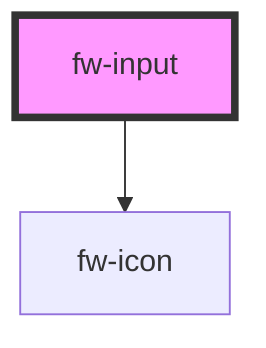

# fw-input

<!-- Auto Generated Below -->

## Properties

| Property       | Attribute      | Description                                                                                           | Type                               | Default     |
| -------------- | -------------- | ----------------------------------------------------------------------------------------------------- | ---------------------------------- | ----------- |
| `autocomplete` | `autocomplete` | Indicates whether the value of the control can be automatically completed by the browser.             | `"off" \| "on"`                    | `'off'`     |
| `clearInput`   | `clear-input`  | If `true`, a clear icon will appear in the input when there is a value. Clicking it clears the input. | `boolean`                          | `false`     |
| `disabled`     | `disabled`     | Indicates that this control is disabled                                                               | `boolean`                          | `false`     |
| `iconLeft`     | `icon-left`    | Name of the icon for left side                                                                        | `string`                           | `undefined` |
| `iconRight`    | `icon-right`   | Name of the icon for right side                                                                       | `string`                           | `undefined` |
| `label`        | `label`        | The type of control to display. The default type is text.                                             | `string`                           | `''`        |
| `maxlength`    | `maxlength`    | Max length of value                                                                                   | `number`                           | `undefined` |
| `minlength`    | `minlength`    | Min length of value                                                                                   | `number`                           | `undefined` |
| `name`         | `name`         | The name of the control, which is submitted with the form data.                                       | `string`                           | `''`        |
| `placeholder`  | `placeholder`  | Instructional text that shows before the input has a value.                                           | `string`                           | `undefined` |
| `readonly`     | `readonly`     | If `true`, the user cannot modify the value.                                                          | `boolean`                          | `false`     |
| `required`     | `required`     | If `true`, the user must fill in a value before submitting a form.                                    | `boolean`                          | `false`     |
| `state`        | `state`        | The state of the control. Color changes accordingly                                                   | `"error" \| "normal" \| "warning"` | `'normal'`  |
| `stateText`    | `state-text`   | This text will be displayed below the input box indicating the state/hint                             | `string`                           | `''`        |
| `type`         | `type`         | The type of control to display. The default type is text.                                             | `"text"`                           | `'text'`    |
| `value`        | `value`        | The value of the input.                                                                               | `string`                           | `''`        |

## Events

| Event      | Description | Type                         |
| ---------- | ----------- | ---------------------------- |
| `fwBlur`   |             | `CustomEvent<void>`          |
| `fwChange` |             | `CustomEvent<any>`           |
| `fwFocus`  |             | `CustomEvent<void>`          |
| `fwInput`  |             | `CustomEvent<KeyboardEvent>` |

## Methods

### `setFocus() => Promise<void>`

Sets focus on the specified `fw-input`. Use this method instead of the global
`input.focus()`.

#### Returns

Type: `Promise<void>`

## Dependencies

### Depends on

- [fw-icon](../icon)

### Graph

----------------------------------------------

*Built with [StencilJS](https://stenciljs.com/)*
