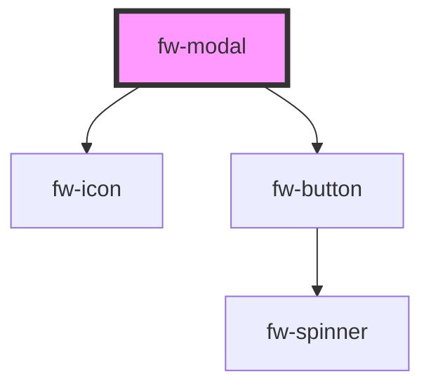

# Modal (fw-modal)

Modals are used as an overlay to display information. It can also be used as confirm boxes to take user inputs.

## Usage

```html live
  <fw-button modal-trigger-id='welcome'> Open Modal </fw-button>
  <fw-modal id='welcome' title-text="Welcome">
    Hello,
    Welcome to Crayons
  </fw-modal>

  <fw-button modal-trigger-id='small'> Open Small Modal </fw-button>
  <fw-modal id='small' title-text="Welcome" size="small">
    This is a small modal
  </fw-modal>

  <fw-button modal-trigger-id='large'> Open Large Modal </fw-button>
  <fw-modal id='large' title-text="Welcome" icon="agent" description="Subtitle goes here" size="large">
    This is a large modal
  </fw-modal>

  <fw-button modal-trigger-id='custom'> Open Custom Footer Modal </fw-button>
  <fw-modal id="custom" title-text="Welcome" icon="agent" description="Subtitle goes here" custom-footer>
    You can customize the footer via `<i>slots</i>`
    <span slot="footer">
      <fw-button color="danger">Confirm</fw-button>
    </span>
  </fw-modal>
```


<!-- Auto Generated Below -->


## Properties

| Property       | Attribute       | Description                                 | Type                               | Default      |
| -------------- | --------------- | ------------------------------------------- | ---------------------------------- | ------------ |
| `cancelText`   | `cancel-text`   | The text for the cancel button              | `string`                           | `'Cancel'`   |
| `customFooter` | `custom-footer` | Enable custom footer                        | `boolean`                          | `false`      |
| `description`  | `description`   | The title text to be displayed on the modal | `string`                           | `undefined`  |
| `hideFooter`   | `hide-footer`   | Hides the footer                            | `boolean`                          | `false`      |
| `icon`         | `icon`          | The icon to be displayed with the title     | `string`                           | `''`         |
| `size`         | `size`          | Size of the modal                           | `"large" or "small" or "standard"` | `'standard'` |
| `successText`  | `success-text`  | The text for the success button             | `string`                           | `'OK'`       |
| `titleText`    | `title-text`    | The title text to be displayed on the modal | `string`                           | `undefined`  |
| `visible`      | `visible`       | Toggle the visibility of the modal          | `boolean`                          | `false`      |


## Events

| Event      | Description                                          | Type                |
| ---------- | ---------------------------------------------------- | ------------------- |
| `fwAction` | Triggered when the default action button is clicked. | `CustomEvent<void>` |
| `fwClosed` | Triggered when modal is closed.                      | `CustomEvent<void>` |


## Dependencies

### Depends on

- [fw-icon](../icon)
- [fw-button](../button)

### Graph


----------------------------------------------

Built with ❤ at Freshworks
