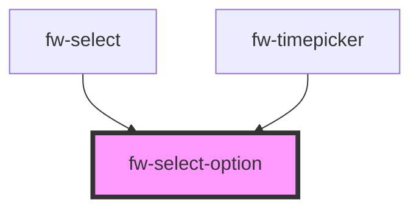

# Select Option (fw-select-option)

fw-select-option provides child elements for fw-select, to populate the Select component’s list or drop-down box with values. If fw-select-option is used without the value attribute, when the form data is saved, the value of fw-select is the selected option’s text. 

## Usage

<fw-select-option selected="true">I am the chosen one</fw-select-option>
<fw-select-option>Me,nein</fw-select-option>
<fw-select-option>I am another option</fw-select-option>

<!-- Auto Generated Below -->

## Properties

| Property   | Attribute  | Description                                                                                                                                                                             | Type      | Default     |
| ---------- | ---------- | --------------------------------------------------------------------------------------------------------------------------------------------------------------------------------------- | --------- | ----------- |
| `selected` | `selected` | Indicates whether the option is selected. The selected option is highlighted and a check mark is displayed next to it. If the attribute’s value is undefined, the value is set to true. | `boolean` | `false`     |
| `value`    | `value`    | Value corresponding to the option, that is saved  when the form data is saved.                                                                                                          | `string`  | `undefined` |

## Events

| Event        | Description                           | Type               |
| ------------ | ------------------------------------- | ------------------ |
| `fwSelected` | Triggered when an option is selected. | `CustomEvent<any>` |

## Dependencies

### Used by

 - [fw-select](../select)
 - [fw-timepicker](../timepicker)

### Graph

----------------------------------------------

Built with ❤ at Freshworks
