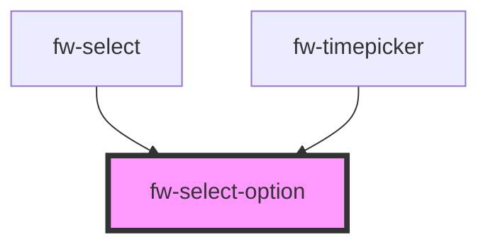

# Select Option

fw-select-option provides child elements for fw-select, to populate the Select component’s list or drop-down box with values. If fw-select-option is used without the value attribute, when the form data is saved, the value of fw-select is the selected option’s text. 

## Usage

<fw-select-option selected="true">I am the chosen one</fw-select-option>
<fw-select-option>Me,nein</fw-select-option>
<fw-select-option>I am another option</fw-select-option>

<!-- Auto Generated Below -->

## Properties

| Property      | Attribute      | Description                                                        | Type      | Default     |
| ------------- | -------------- | ------------------------------------------------------------------ | --------- | ----------- |
| `html`        | `html`         | Boolean saying if option is html                                   | `boolean` | `false`     |
| `htmlContent` | `html-content` | String containing html content for option                          | `string`  | `undefined` |
| `optionText`  | `option-text`  | If option is html and alternate text is needed for label           | `string`  | `undefined` |
| `selected`    | `selected`     | Flag to indicate if the option is selected or not. A tick is shown | `boolean` | `false`     |
| `value`       | `value`        | The Key associated with this select option                         | `string`  | `undefined` |

## Events

| Event        | Description | Type               |
| ------------ | ----------- | ------------------ |
| `fwSelected` |             | `CustomEvent<any>` |

## Dependencies

### Used by

 - [fw-select](../select)
 - [fw-timepicker](../timepicker)

### Graph

----------------------------------------------

Built with ❤ at Freshworks
