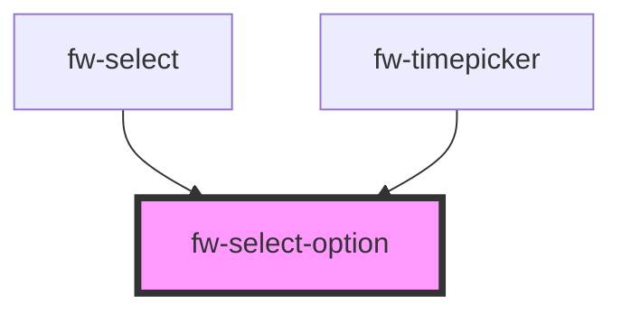

# fw-select-option

<!-- Auto Generated Below -->

## Properties

| Property   | Attribute  | Description                                                        | Type      | Default     |
| ---------- | ---------- | ------------------------------------------------------------------ | --------- | ----------- |
| `selected` | `selected` | Flag to indicate if the option is selected or not. A tick is shown | `boolean` | `false`     |
| `value`    | `value`    | The Key associated with this select option                         | `string`  | `undefined` |

## Events

| Event        | Description | Type               |
| ------------ | ----------- | ------------------ |
| `fwSelected` |             | `CustomEvent<any>` |

## Dependencies

### Used by

 - [fw-select](../select)
 - [fw-timepicker](../timepicker)

### Graph

----------------------------------------------

*Built with [StencilJS](https://stenciljs.com/)*
