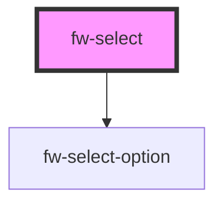

# fw-select

<!-- Auto Generated Below -->

## Properties

| Property        | Attribute        | Description                                                               | Type                               | Default     |
| --------------- | ---------------- | ------------------------------------------------------------------------- | ---------------------------------- | ----------- |
| `disabled`      | `disabled`       | Indicates that this control is disabled                                   | `boolean`                          | `false`     |
| `forceSelect`   | `force-select`   | If `true`, the user must select some value. The default wont be shown     | `boolean`                          | `false`     |
| `label`         | `label`          | Label for the control                                                     | `string`                           | `''`        |
| `name`          | `name`           | The name of the control, which is submitted with the form data.           | `string`                           | `""`        |
| `placeholder`   | `placeholder`    | Instructional text that shows before the selection is made                | `string`                           | `undefined` |
| `readonly`      | `readonly`       | If `true`, the user cannot modify the value.                              | `boolean`                          | `false`     |
| `required`      | `required`       | If `true`, the user must fill in a value before submitting a form.        | `boolean`                          | `false`     |
| `selectedValue` | `selected-value` | Set the selected Value                                                    | `string`                           | `undefined` |
| `state`         | `state`          | The state of the control. Color changes accordingly                       | `"error" \| "normal" \| "warning"` | `'normal'`  |
| `stateText`     | `state-text`     | This text will be displayed below the input box indicating the state/hint | `string`                           | `''`        |
| `value`         | `value`          | The value of the input. Similar to an input value                         | `string`                           | `''`        |

## Events

| Event      | Description | Type               |
| ---------- | ----------- | ------------------ |
| `fwBlur`   |             | `CustomEvent<any>` |
| `fwChange` |             | `CustomEvent<any>` |
| `fwFocus`  |             | `CustomEvent<any>` |

## Dependencies

### Depends on

- [fw-select-option](../select-option)

### Graph

----------------------------------------------

*Built with [StencilJS](https://stenciljs.com/)*
