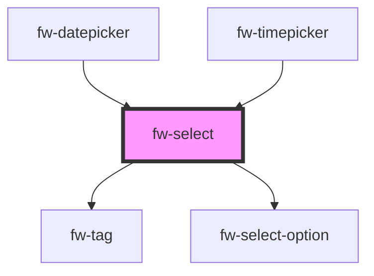

# Select (fw-select)
fw-select displays a list or drop-down box that enables selection of an option or multiple options from an available list of values.

## Usage

```html live
<fw-select label="House Name" required="true" value="1" placeholder="Your choice" state-text="Select singluar option">
  <fw-select-option value="1">Starks</fw-select-option>
  <fw-select-option value="2">Lannisters</fw-select-option>
</fw-select>
<fw-select label="Names" value="1" placeholder="Your choices" state-text="Select multiple options" multiple>
  <fw-select-option value="1" selected>Starks</fw-select-option>
  <fw-select-option value="2" >Lannisters</fw-select-option>
  <fw-select-option value="3">Sand</fw-select-option>
  <fw-select-option value="4">Greyjoys</fw-select-option>
  <fw-select-option value="5">Tyrell</fw-select-option>
</fw-select>
```


<!-- Auto Generated Below -->


## Properties

| Property      | Attribute      | Description                                                                                                                                                             | Type                               | Default     |
| ------------- | -------------- | ----------------------------------------------------------------------------------------------------------------------------------------------------------------------- | ---------------------------------- | ----------- |
| `autofocus`   | `autofocus`    | If true, the select component is auto focused on the page                                                                                                               | `boolean`                          | `false`     |
| `disabled`    | `disabled`     | Disables the component on the interface. If the attribute’s value is undefined, the value is set to false.                                                              | `boolean`                          | `false`     |
| `forceSelect` | `force-select` | If true, the user must select a value. The default value is not displayed.                                                                                              | `boolean`                          | `true`      |
| `label`       | `label`        | Label displayed on the interface, for the component.                                                                                                                    | `string`                           | `''`        |
| `multiple`    | `multiple`     | Enables selection of multiple options. If the attribute’s value is undefined, the value is set to false.                                                                | `boolean`                          | `false`     |
| `name`        | `name`         | Name of the component, saved as part of form data.                                                                                                                      | `string`                           | `''`        |
| `placeholder` | `placeholder`  | Text displayed in the list box before an option is selected.                                                                                                            | `string`                           | `undefined` |
| `readonly`    | `readonly`     | If true, the user cannot modify the default value selected. If the attribute's value is undefined, the value is set to true.                                            | `boolean`                          | `false`     |
| `required`    | `required`     | Specifies the select field as a mandatory field and displays an asterisk next to the label. If the attribute’s value is undefined, the value is set to false.           | `boolean`                          | `false`     |
| `state`       | `state`        | Theme based on which the list box is styled.                                                                                                                            | `"error" or "normal" or "warning"` | `'normal'`  |
| `stateText`   | `state-text`   | Descriptive or instructional text displayed below the list box.                                                                                                         | `string`                           | `''`        |
| `type`        | `type`         | Type of option accepted as the input value. If a user tries to enter an option other than the specified type, the list is not populated.                                | `"number" or "text"`               | `'text'`    |
| `value`       | `value`        | Value of the option that is displayed as the default selection, in the list box. Must be a valid value corresponding to the fw-select-option components used in Select. | `any`                              | `undefined` |


## Events

| Event      | Description                                                                 | Type               |
| ---------- | --------------------------------------------------------------------------- | ------------------ |
| `fwBlur`   | Triggered when the list box loses focus.                                    | `CustomEvent<any>` |
| `fwChange` | Triggered when a value is selected or deselected from the list box options. | `CustomEvent<any>` |
| `fwFocus`  | Triggered when the list box comes into focus.                               | `CustomEvent<any>` |


## Methods

### `getSelectedItem() => Promise<any>`


#### Returns

Type: `Promise<any>`


## Dependencies

### Used by

 - [fw-datepicker](../datepicker)
 - [fw-timepicker](../timepicker)

### Depends on

- [fw-tag](../tag)
- [fw-select-option](../select-option)

### Graph


----------------------------------------------

Built with ❤ at Freshworks
