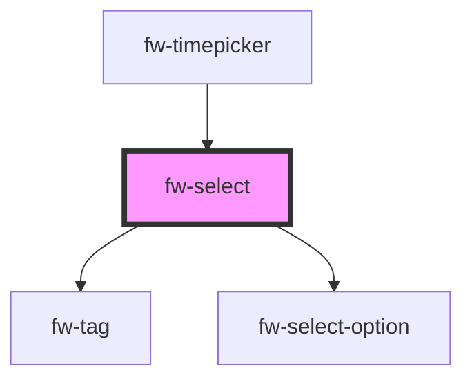

# Select
Select is an input control (list or drop-down box) that enables selection of an option or multiple options from an available list of values.

## Usage

```html live
<fw-select label="Select the house" required="true" value="1">
  <fw-select-option value="1">Starks</fw-select-option>
  <fw-select-option value="2">Lannisters</fw-select-option>
</fw-select>
```


<!-- Auto Generated Below -->


## Properties

| Property      | Attribute      | Description                                                                                                        | Type                               | Default     |
| ------------- | -------------- | ------------------------------------------------------------------------------------------------------------------ | ---------------------------------- | ----------- |
| `disabled`    | `disabled`     | Indicates that this control is disabled                                                                            | `boolean`                          | `false`     |
| `forceSelect` | `force-select` | If true, the user must select some value. The default wont be shown                                                | `boolean`                          | `true`      |
| `label`       | `label`        | Label displayed on the interface, for the component.                                                               | `string`                           | `''`        |
| `multiple`    | `multiple`     | Enables selection of multiple options. If the attribute’s value is undefined, the value is set to true.            | `boolean`                          | `false`     |
| `name`        | `name`         | Name of the component, saved as part of form data.                                                                 | `string`                           | `''`        |
| `placeholder` | `placeholder`  | Text displayed in the control before an option is selected.                                                        | `string`                           | `undefined` |
| `readonly`    | `readonly`     | If true, the user cannot modify the value.                                                                         | `boolean`                          | `false`     |
| `required`    | `required`     | Specifies the input control as a mandatory field. If the attribute’s value is undefined, the value is set to true. | `boolean`                          | `false`     |
| `state`       | `state`        | The state of the control. Color changes accordingly                                                                | `"error" or "normal" or "warning"` | `'normal'`  |
| `stateText`   | `state-text`   | This text will be displayed below the input box indicating the state/hint                                          | `string`                           | `''`        |
| `type`        | `type`         | The type of control to display. The default type is text.                                                          | `"number" or "text"`               | `'text'`    |
| `value`       | `value`        | Value of the option that is displayed as the default selection, in the input control.                              | `any`                              | `undefined` |


## Events

| Event      | Description | Type               |
| ---------- | ----------- | ------------------ |
| `fwBlur`   |             | `CustomEvent<any>` |
| `fwChange` |             | `CustomEvent<any>` |
| `fwFocus`  |             | `CustomEvent<any>` |


## Methods

### `getSelectedItem() => Promise<any>`


#### Returns

Type: `Promise<any>`


## Dependencies

### Used by

 - [fw-timepicker](../timepicker)

### Depends on

- [fw-tag](../tag)
- [fw-select-option](../select-option)

### Graph


----------------------------------------------

Built with ❤ at Freshworks
