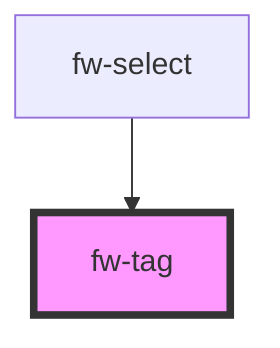

# fw-tag

<!-- Auto Generated Below -->

## Properties

| Property | Attribute | Description                  | Type     | Default     |
| -------- | --------- | ---------------------------- | -------- | ----------- |
| `text`   | `text`    | The display text for the tag | `string` | `undefined` |
| `value`  | `value`   | The value of the tag         | `string` | `undefined` |

## Events

| Event      | Description | Type               |
| ---------- | ----------- | ------------------ |
| `fwClosed` |             | `CustomEvent<any>` |

## Dependencies

### Used by

 - [fw-select](../select)

### Graph

----------------------------------------------

*Built with [StencilJS](https://stenciljs.com/)*
