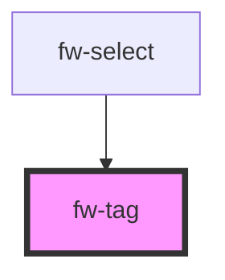

# Tag (fw-tag)
fw-tag provides a child component that is used to enable selecting multiple options in the Select component. 

## Usage

<fw-tag text="Option"></fw-tag>

<!-- Auto Generated Below -->

## Properties

| Property | Attribute | Description                                                                         | Type     | Default     |
| -------- | --------- | ----------------------------------------------------------------------------------- | -------- | ----------- |
| `text`   | `text`    | Display text in the tag component.                                                  | `string` | `undefined` |
| `value`  | `value`   | Value associated with the tag component, that is saved when the form data is saved. | `string` | `undefined` |

## Events

| Event      | Description                           | Type               |
| ---------- | ------------------------------------- | ------------------ |
| `fwClosed` | Triggered when the tag is deselected. | `CustomEvent<any>` |

## Dependencies

### Used by

 - [fw-select](../select)

### Graph

----------------------------------------------

Built with ❤ at Freshworks
