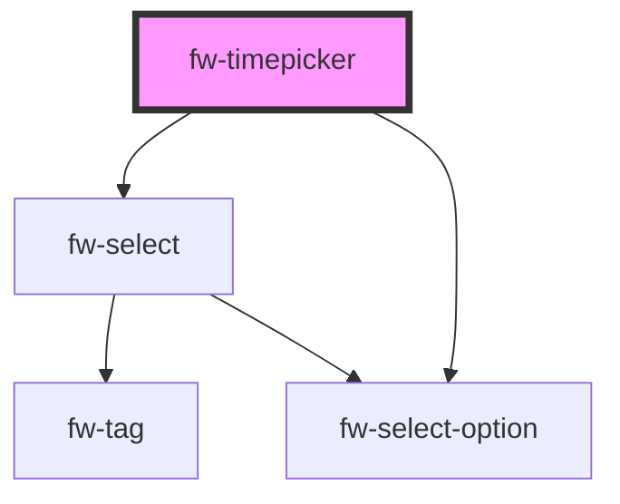

# Timepicker (fw-timepicker)
fw-timepicker displays a list or drop-down box with prepopulated time values and enables picking a time. The time values displayed in the list box are based on the fw-timepicker attribute values.


## Usage

```html live
<fw-label value="An interval based picker" color="yellow"></fw-label><br/> 
<fw-timepicker interval=45 hour-format="hh:mm p"></fw-timepicker>
<fw-label value="A range based picker" color="yellow"></fw-label><br/>
<fw-timepicker min-time="04:30" max-time="08:30 PM"></fw-timepicker>
```
<!-- Auto Generated Below -->


## Properties

| Property     | Attribute     | Description                             | Type     | Default                                        |
| ------------ | ------------- | --------------------------------------- | -------- | ---------------------------------------------- |
| `hourFormat` | `hour-format` | Format of the time for input and output | `string` | `'hh:mm p'`                                    |
| `interval`   | `interval`    | interval bw two time in minutes         | `number` | `30`                                           |
| `maxTime`    | `max-time`    | Max time                                | `string` | `this.isMeridianFormat ? '11:30 PM' : '23:30'` |
| `minTime`    | `min-time`    | Min  time                               | `string` | `this.isMeridianFormat ? '12:00 AM' : '00:00'` |
| `timeValue`  | `time-value`  | time output value                       | `string` | `undefined`                                    |


## Dependencies

### Depends on

- [fw-select](../select)
- [fw-select-option](../select-option)

### Graph


----------------------------------------------

Built with ❤ at Freshworks
