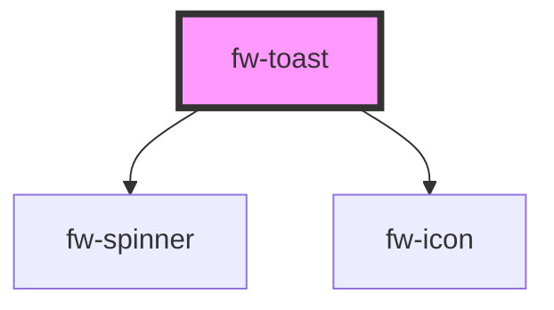

# fw-toast

<!-- Auto Generated Below -->

## Properties

| Property         | Attribute          | Description                                              | Type                                                | Default        |
| ---------------- | ------------------ | -------------------------------------------------------- | --------------------------------------------------- | -------------- |
| `actionLinkText` | `action-link-text` | The Content of the action link                           | `string`                                            | `''`           |
| `content`        | `content`          | The content to be diaplyed in toast                      | `string`                                            | `undefined`    |
| `pauseOnHover`   | `pause-on-hover`   | Pause the toast from hiding on mouse hover               | `boolean`                                           | `undefined`    |
| `position`       | `position`         | Pause the toast from hiding on mouse hover               | `"top-center" or "top-left" or "top-right"`         | `'top-center'` |
| `sticky`         | `sticky`           | won't close automatically                                | `boolean`                                           | `false`        |
| `timeout`        | `timeout`          | Time duration of the toast visibility                    | `number`                                            | `2000`         |
| `type`           | `type`             | Type of the toast - success,failure, warning, inprogress | `"error" or "inprogress" or "success" or "warning"` | `'warning'`    |

## Events

| Event         | Description                             | Type               |
| ------------- | --------------------------------------- | ------------------ |
| `fwLinkClick` | Triggered when the action link clicked. | `CustomEvent<any>` |

## Methods

### `trigger(configs: object) => Promise<void>`

#### Returns

Type: `Promise<void>`

## Dependencies

### Depends on

- [fw-spinner](../spinner)
- [fw-icon](../icon)

### Graph

----------------------------------------------

Built with ❤ at Freshworks
