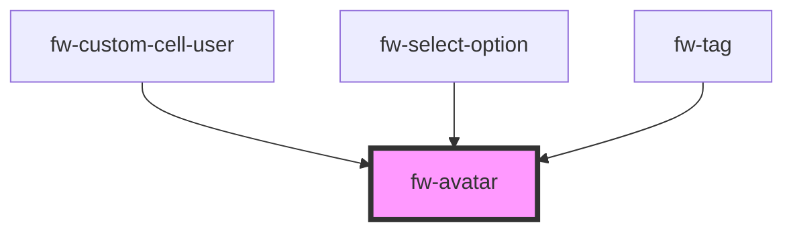

# Avatar (fw-avatar)

Avatars are used to represent a person or object.

## Demo

```html live
<section>
  <fw-avatar
    size="medium"
    image="https://images.unsplash.com/photo-1529778873920-4da4926a72c2?ixlib=rb-1.2.1&auto=format&fit=crop&w=300&q=80"
  ></fw-avatar>
  <fw-avatar initials="PT"></fw-avatar>
  <fw-avatar name="Patrick Goodwin"></fw-avatar>
</section>
```

Avatar of different sizes

```html live
<section>
  <fw-avatar
    size="medium"
    image="https://images.unsplash.com/photo-1529778873920-4da4926a72c2?ixlib=rb-1.2.1&auto=format&fit=crop&w=300&q=80"
  ></fw-avatar>
  <fw-avatar
    size="small"
    image="https://images.unsplash.com/photo-1529778873920-4da4926a72c2?ixlib=rb-1.2.1&auto=format&fit=crop&w=300&q=80"
  ></fw-avatar>
</section>
```

Avatar with Light and Dark mode

```html live
<section>
  <fw-avatar mode="dark" initials="PT"></fw-avatar>
  <fw-avatar mode="light" initials="PT"></fw-avatar>
</section>
```

## Usage

<code-group>
<code-block title="HTML">
``` html
<section>
  <fw-avatar
    size="medium"
    image="https://images.unsplash.com/photo-1529778873920-4da4926a72c2?ixlib=rb-1.2.1&auto=format&fit=crop&w=300&q=80"></fw-avatar>
  <fw-avatar
    size="small"
    image="https://images.unsplash.com/photo-1529778873920-4da4926a72c2?ixlib=rb-1.2.1&auto=format&fit=crop&w=300&q=80"></fw-avatar>
</section>
<section>
<fw-avatar size="medium" image="https://images.unsplash.com/photo-1529778873920-4da4926a72c2?ixlib=rb-1.2.1&auto=format&fit=crop&w=300&q=80"> </fw-avatar>
<fw-avatar size="small" image="https://images.unsplash.com/photo-1529778873920-4da4926a72c2?ixlib=rb-1.2.1&auto=format&fit=crop&w=300&q=80"> </fw-avatar>
</section>
```
</code-block>

<code-block title="React">
```jsx
import React from "react";
import ReactDOM from "react-dom";
import { FwAvatar } from "@freshworks/crayons/react";
function App() {
  return (<div>
    <FwAvatar  image="https://images.unsplash.com/photo-1529778873920-4da4926a72c2?ixlib=rb-1.2.1&auto=format&fit=crop&w=300&q=80"></FwAvatar>

    <FwAvatar  mode="dark" initials="PT" ></FwAvatar>
    <FwAvatar  mode="light" initials="PT" ></FwAvatar>

    <FwAvatar  size="medium" image="https://images.unsplash.com/photo-1529778873920-4da4926a72c2?ixlib=rb-1.2.1&auto=format&fit=crop&w=300 q=80"></FwAvatar>
    <FwAvatar  size="small"  image="https://images.unsplash.com/photo-1529778873920-4da4926a72c2?ixlib=rb-1.2.1&auto=format&fit=crop&w=300&q=80"></FwAvatar>

  </div>)
}
```
</code-block>
</code-group>
<!-- Auto Generated Below -->


## Properties

| Property   | Attribute  | Description | Type                                                                               | Default     |
| ---------- | ---------- | ----------- | ---------------------------------------------------------------------------------- | ----------- |
| `alt`      | `alt`      |             | `string`                                                                           | `undefined` |
| `image`    | `image`    |             | `string`                                                                           | `undefined` |
| `initials` | `initials` |             | `string`                                                                           | `undefined` |
| `mode`     | `mode`     |             | `"dark" \| "light"`                                                                | `'dark'`    |
| `name`     | `name`     |             | `string`                                                                           | `''`        |
| `shape`    | `shape`    |             | `"circle" \| "rounded" \| "square"`                                                | `'circle'`  |
| `size`     | `size`     |             | `"large" \| "medium" \| "small" \| "xlarge" \| "xsmall" \| "xxlarge" \| "xxsmall"` | `'large'`   |


## Shadow Parts

| Part         | Description |
| ------------ | ----------- |
| `"image"`    |             |
| `"initials"` |             |


## Dependencies

### Used by

 - [fw-custom-cell-user](../data-table/custom-cells/user)
 - [fw-select-option](../select-option)
 - [fw-tag](../tag)

### Graph


----------------------------------------------

Built with ❤ at Freshworks
