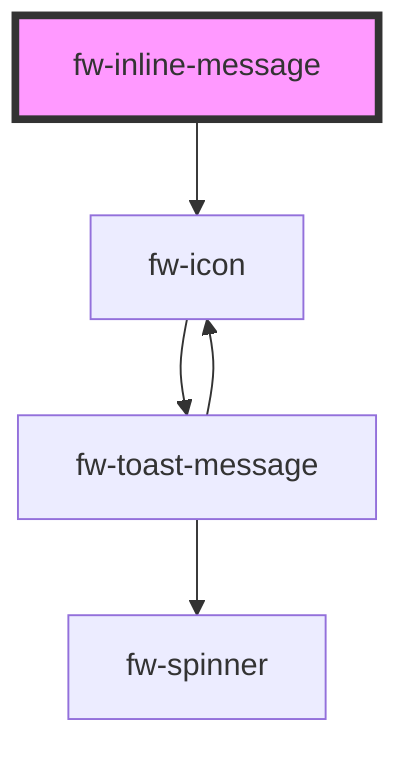

# Inline Message (fw-inline-message)
fw-inline-message displays an alert on the user interface and enables displaying additional information to the context of the page.
## Demo
```html live
<section>
  <fw-label value="Try types"></fw-label>
  <fw-inline-message open type="error">This is an error alert message.</fw-inline-message>
  <fw-inline-message open type="info">This is an info alert message.</fw-inline-message>
  <fw-inline-message open type="warning">This is a warning alert message.</fw-inline-message>
  <fw-inline-message open type="success">This is a success alert message.</fw-inline-message>
</section>
<br />
<section>
  <fw-label value="Try types with closable alerts"></fw-label>
  <fw-inline-message open closable type="error">This is an error alert message with close option.</fw-inline-message>
  <fw-inline-message open closable type="info">This is an info alert message with close option.</fw-inline-message>
  <fw-inline-message open closable type="warning">This is a warning alert message with close option.</fw-inline-message>
  <fw-inline-message open closable type="success">This is a success alert message with close option.</fw-inline-message>
</section>
<br />
```

## Usage

<code-group>
<code-block title="HTML">
``` html
<section>
  <fw-label value="Try types"></fw-label>
  <fw-inline-message open type="error">This is an error alert message.</fw-inline-message>
  <fw-inline-message open type="info">This is an info alert message.</fw-inline-message>
  <fw-inline-message open type="warning">This is a warning alert message.</fw-inline-message>
  <fw-inline-message open type="success">This is a success alert message.</fw-inline-message>
</section>
<br />
<section>
  <fw-label value="Try types with closable alerts"></fw-label>
  <fw-inline-message open closable type="error">This is an error alert message with close option.</fw-inline-message>
  <fw-inline-message open closable type="info">This is an info alert message with close option.</fw-inline-message>
  <fw-inline-message open closable type="warning">This is a warning alert message with close option.</fw-inline-message>
  <fw-inline-message open closable type="success">This is a success alert message with close option.</fw-inline-message>
</section>
<br />
```
</code-block>

<code-block title="React">
```jsx
import React from "react";
import ReactDOM from "react-dom";
import { FWLabel, FwInlineMessage } from "@freshworks/crayons/react";
function App() {
  return (<div>
  <section>
    <FwLabel value="Try types"></FwLabel>
    <FwInlineMessage open type="error">This is an error alert message.</FwInlineMessage>
    <FwInlineMessage open type="info">This is an info alert message.</FwInlineMessage>
    <FwInlineMessage open type="warning">This is a warning alert message.</FwInlineMessage>
    <FwInlineMessage open type="success">This is a success alert message.</FwInlineMessage>
  </section>
  <br />
  <section>
    <FwLabel value="Try types with closable alerts"></FwLabel>
    <FwInlineMessage open closable type="error">This is an error alert message with close option.</FwInlineMessage>
    <FwInlineMessage open closable type="info">This is an info alert message with close option.</FwInlineMessage>
    <FwInlineMessage open closable type="warning">This is a warning alert message with close option.</FwInlineMessage>
    <FwInlineMessage open closable type="success">This is a success alert message with close option.</FwInlineMessage>
  </section>
  <br />
  </div>)
}
```
</code-block>
</code-group>

<!-- Auto Generated Below -->


## Properties

| Property   | Attribute  | Description                                                          | Type                                          | Default    |
| ---------- | ---------- | -------------------------------------------------------------------- | --------------------------------------------- | ---------- |
| `closable` | `closable` | Makes the inline message closable.                                   | `boolean`                                     | `true`     |
| `duration` | `duration` | The duration in milliseconds for which inline message will be shown. | `number`                                      | `Infinity` |
| `open`     | `open`     | Indicates whether the inline message is open or not.                 | `boolean`                                     | `true`     |
| `type`     | `type`     | The type of inline message to be displayed. Defaults to info.        | `"error" \| "info" \| "success" \| "warning"` | `'info'`   |


## Events

| Event    | Description                              | Type               |
| -------- | ---------------------------------------- | ------------------ |
| `fwHide` | Triggered when inline message is hidden. | `CustomEvent<any>` |
| `fwShow` | Triggered when inline message is shown.  | `CustomEvent<any>` |


## Methods

### `hide() => Promise<void>`


#### Returns

Type: `Promise<void>`


### `show() => Promise<void>`


#### Returns

Type: `Promise<void>`


## Dependencies

### Depends on

- [fw-icon](../icon)

### Graph


----------------------------------------------

Built with ❤ at Freshworks
