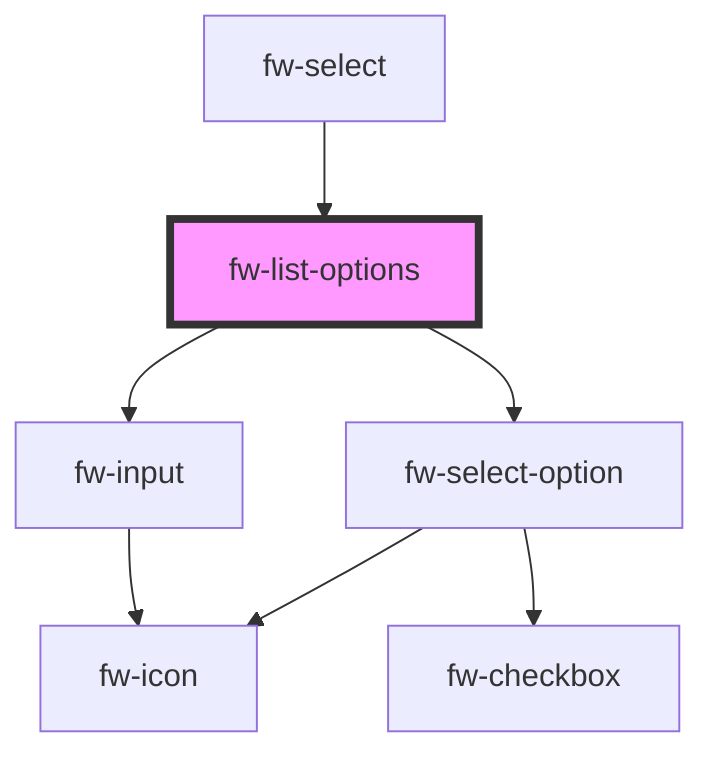

# fw-list-options

<!-- Auto Generated Below -->

## Properties

| Property       | Attribute        | Description                                                                                                                                                                                                                               | Type                               | Default            |
| -------------- | ---------------- | ----------------------------------------------------------------------------------------------------------------------------------------------------------------------------------------------------------------------------------------- | ---------------------------------- | ------------------ |
| `filterText`   | `filter-text`    | The text to filter the options.                                                                                                                                                                                                           | `any`                              | `undefined`        |
| `isCheckbox`   | `is-checkbox`    | Place a checkbox.                                                                                                                                                                                                                         | `boolean`                          | `false`            |
| `max`          | `max`            | Works with `multiple` enabled. Configures the maximum number of options that can be selected with a multi-select component.                                                                                                               | `number`                           | `Number.MAX_VALUE` |
| `multiple`     | `multiple`       | Enables selection of multiple options. If the attribute’s value is undefined, the value is set to false.                                                                                                                                  | `boolean`                          | `false`            |
| `notFoundText` | `not-found-text` | Default option to be shown if the option doesn't match the filterText.                                                                                                                                                                    | `string`                           | `'No items Found'` |
| `options`      | --               | Value corresponding to the option, that is saved  when the form data is saved.                                                                                                                                                            | `any[]`                            | `[]`               |
| `searchText`   | `search-text`    | Placeholder to placed on the search text box.                                                                                                                                                                                             | `string`                           | `'Search...'`      |
| `searchable`   | `searchable`     | Enables the input with in the popup for filtering the options.                                                                                                                                                                            | `boolean`                          | `false`            |
| `value`        | --               | Value of the option that is displayed as the default selection, in the list box. Must be a valid value corresponding to the fw-select-option components used in Select.                                                                   | `any[]`                            | `[]`               |
| `variant`      | `variant`        | Standard is the default option without any graphics other options are icon and avatar which places either the icon or avatar at the beginning of the row. The props for the icon or avatar are passed as an object via the graphicsProps. | `"avatar" \| "icon" \| "standard"` | `'standard'`       |

## Events

| Event      | Description                                                                 | Type               |
| ---------- | --------------------------------------------------------------------------- | ------------------ |
| `fwChange` | Triggered when a value is selected or deselected from the list box options. | `CustomEvent<any>` |

## Methods

### `getSelectedOptions() => Promise<any>`

#### Returns

Type: `Promise<any>`

### `setSelectedValues(values: string[]) => Promise<any>`

#### Returns

Type: `Promise<any>`

## Dependencies

### Used by

 - [fw-select](../select)

### Depends on

- [fw-select-option](../select-option)
- [fw-input](../input)

### Graph

----------------------------------------------

Built with ❤ at Freshworks
